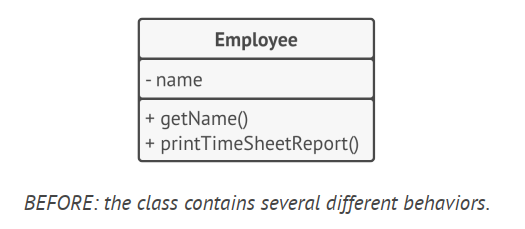
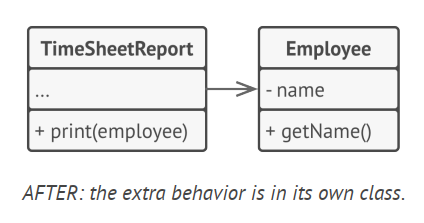
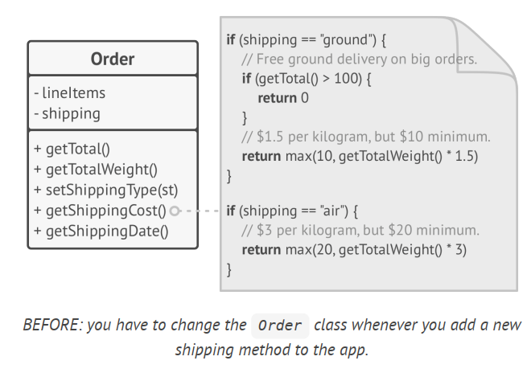
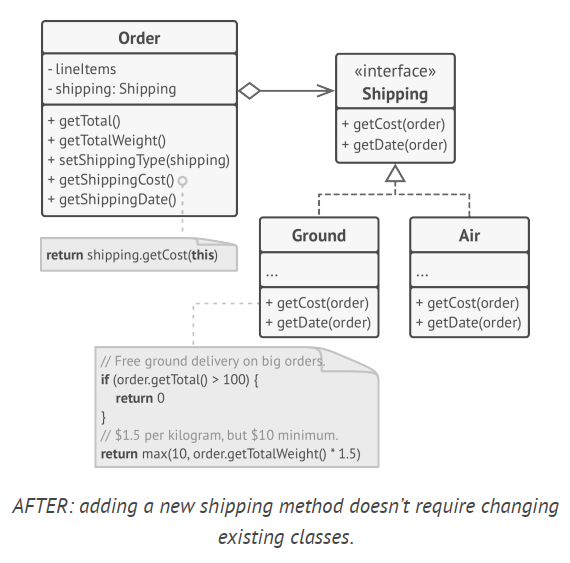
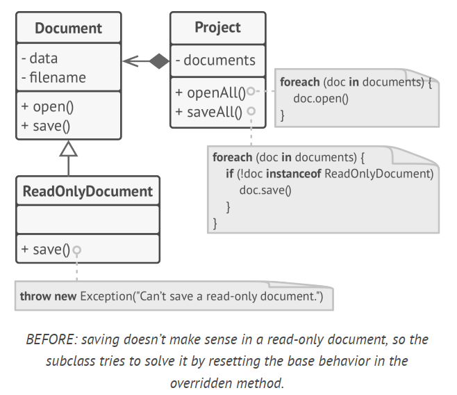
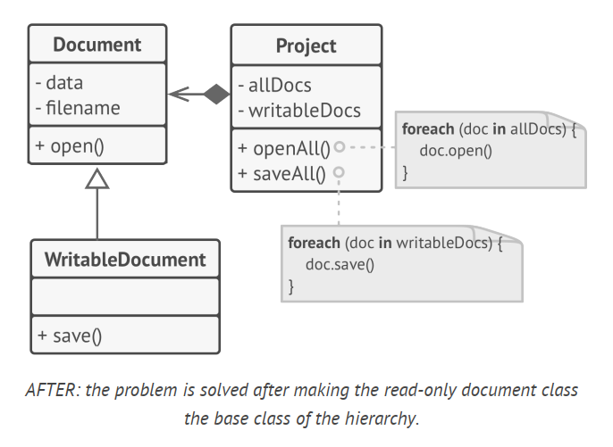
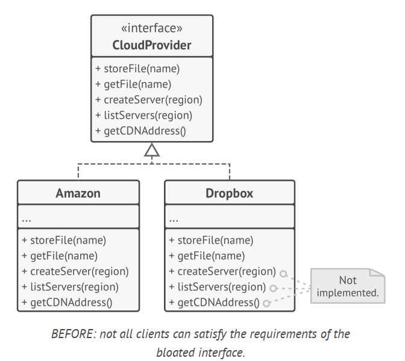
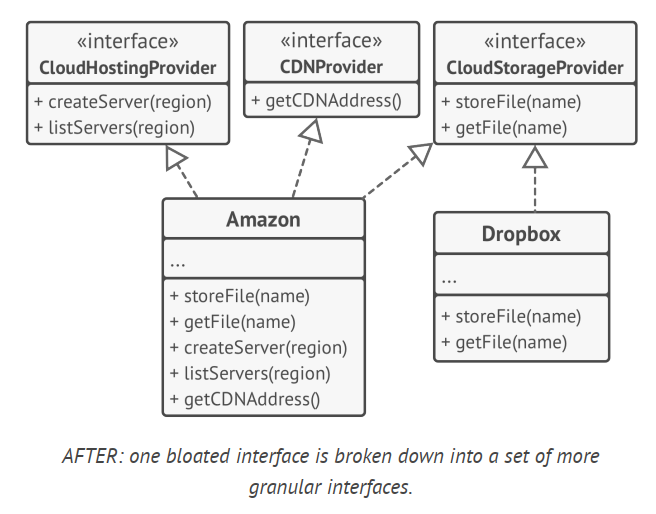
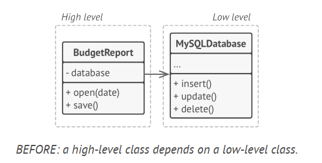
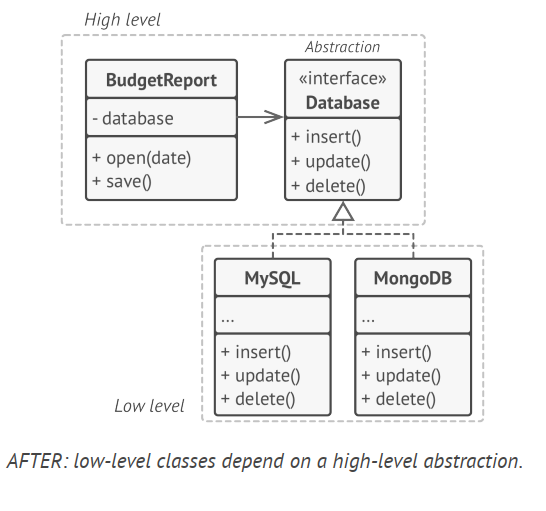

# SOLID Principles

SOLID is a mnemonic for five design principles intended to make software designs more understandable, flexible and maintainable.

The cost of applying these principles into a program’s architecture might be making it
more complicated than it should be. I doubt that there’s a successful software product in which all of these principles are applied at the same time. Striving for these principles is good, but always try to be pragmatic and don’t take everything written here as dogma.

## Single Responsibility Principle

> A class should have just one reason to change.

Try to make every class responsible for a single part of the functionality provided by the software, and make that responsibility entirely encapsulated by (you can also say hidden within) the class.

The main goal of this principle is reducing complexity. You don’t need to invent a sophisticated design for a program that only has about 200 lines of code. Make a dozen methods pretty, and you’ll be fine.

The real problems emerge when your program constantly grows and changes. At some point classes become so big that you can no longer remember their details. Code navigation
slows down to a crawl, and you have to scan through whole classes or even an entire program to find specific things. The number of entities in program overflows your brain stack, and you feel that you’re losing control over the code.

### Example

The Employee class has several reasons to change. The first reason might be related to the main job of the class: managing employee data. However, there’s another reason: the format of the timesheet report may change over time, requiring you to change the code within the class.

Solve the problem by moving the behavior related to printing timesheet reports into a separate class. This change lets you move other report-related stuff to the new class.

## Open/Closed Principle

> Classes should be open for extension but closed for modification.

The main idea of this principle is to keep existing code from breaking when you implement new features.

A class is open if you can extend it, produce a subclass and do whatever you want with it—add new methods or fields, override base behavior, etc. Some programming languages let you restrict further extension of a class with special keywords, such as final . After this, the class is no longer open. At the same time, the class is closed (you can also say complete) if it’s 100% ready to be used by other classes—its interface is clearly
defined and won’t be changed in the future.

If a class is already developed, tested, reviewed, and included in some framework or otherwise used in an app, trying to mess with its code is risky. Instead of changing the code of the class directly, you can create a subclass and override parts of the original class that you want to behave differently. You’ll achieve your goal but also won’t break any existing clients of the original class.

### Example

You have an e-commerce application with an Order class that calculates shipping costs and all shipping methods are hardcoded inside the class. If you need to add a new shipping method, you have to change the code of the Order class and risk breaking it.

You can solve the problem by applying the Strategy pattern. Start by extracting shipping methods into separate classes with a common interface.

Now when you need to implement a new shipping method, you can derive a new class from the Shipping interface without touching any of the Order class’ code. The client code of the Order class will link orders with a shipping object of the new class whenever the user selects this shipping methods in the UI.

As a bonus, this solution let you move the delivery time calculation to more relevant classes, according to the single responsibility principle.

## Liskov Substitution Principle

> When extending a class, remember that you should be able to pass objects of the subclass in place of objects of the parent class without breaking the client code.

This means that the subclass should remain compatible with the behavior of the superclass. When overriding a method, extend the base behavior rather than replacing it with something else entirely.

The substitution principle is a set of checks that help predict whether a subclass remains compatible with the code that was able to work with objects of the superclass.

Unlike other design principles which are wide open for interpretation, the substitution principle has a set of formal requirements for subclasses, and specifically for their methods. Let’s go over this checklist in detail.

- Parameter types in a method of a subclass should match or be more abstract than parameter types in the method of the superclass.
- The return type in a method of a subclass should match or be a subtype of the return type in the method of the superclass.
- A method in a subclass shouldn’t throw types of exceptions which the base method isn’t expected to throw.
- A subclass shouldn’t strengthen pre-conditions.
- A subclass shouldn’t weaken post-conditions.
- Invariants of a superclass must be preserved.
- A subclass shouldn’t change values of private fields of the superclass.

### Example

Let’s look at an example of a hierarchy of document classes that violates the substitution principle.

The save method in the ReadOnlyDocuments subclass throws an exception if someone tries to call it. The base method doesn’t have this restriction. This means that the client code
will break if we don’t check the document type before saving it.

The resulting code also violates the open/closed principle, since the client code becomes dependent on concrete classes of documents. If you introduce a new document subclass, you’ll need to change the client code to support it.

You can solve the problem by redesigning the class hierarchy: a subclass should extend the behavior of a superclass, therefore the read-only document becomes the base class of
the hierarchy. The writable document is now a subclass which extends the base class and adds the saving behavior.

## Interface Segregation Principle

> Clients shouldn’t be forced to depend on methods they do not use.

According to the interface segregation principle, you should break down “fat” interfaces into more granular and specific ones. Clients should implement only those methods that they really need. Otherwise, a change to a “fat” interface would break even clients that don’t use the changed methods.

Class inheritance lets a class have just one superclass, but it doesn’t limit the number of interfaces that the class can implement at the same time. Hence, there’s no need to cram tons of unrelated methods to a single interface. Break it down into several more refined interfaces—you can implement them all in a single class if needed. However, some classes may be fine with implementing just one of them.

### Example

Imagine that you created a library that makes it easy to integrate apps with various cloud computing providers. While in the initial version it only supported Amazon Cloud, it covered the full set of cloud services and features.

While you can still implement these methods and put some stubs there, it wouldn’t be a pretty solution. The better approach is to break down the interface into parts. Classes
that are able to implement the original interface can now just implement several refined interfaces. Other classes can implement only those interfaces which have methods that make
sense for them.

As with the other principles, you can go too far with this one.
Don’t further divide an interface which is already quite specific. Remember that the more interfaces you create, the more complex your code becomes. Keep the balance.

## Dependency Inversion Principle

> High-level classes shouldn’t depend on low-level classes. Both should depend on abstractions. Abstractions shouldn’t depend on details. Details should depend on
abstractions.

Usually when designing software, you can make a distinction between two levels of classes.

- **Low-level classes** implement basic operations such as working with a disk, transferring data over a network, connecting to a database, etc.
- **High-level classes** contain complex business logic that directs low-level classes to do something.

> Sometimes people design low-level classes first and only then start working on high-level ones.

The dependency inversion principle suggests changing the direction of this dependency.

1. For starters, you need to describe interfaces for low-level operations that high-level classes rely on, preferably in business terms. For instance, business logic should call a method openReport(file) rather than a series of methods openFile(x) , readBytes(n) , closeFile(x) . These interfaces count as high-level ones.
2. Now you can make high-level classes dependent on those interfaces, instead of on concrete low-level classes. This dependency will be much softer than the original one.
3. Once low-level classes implement these interfaces, they become dependent on the business logic level, reversing the direction of the original dependency.
The dependency inversion principle often goes along with the open/closed principle: you can extend low-level classes to use with different business logic classes without breaking existing classes.

### Example

In this example, the high-level budget reporting class uses a low-level database class for reading and persisting its data. This means that any change in the low-level class, such as
when a new version of the database server gets released, may affect the high-level class, which isn’t supposed to care about the data storage details.

You can fix this problem by creating a high-level interface that describes read/write operations and making the reporting class use that interface instead of the low-level class. Then you can change or extend the original low-level class to implement the new read/write interface declared by the business logic.

As a result, the direction of the original dependency has been inverted: low-level classes are now dependent on high-level abstractions.

