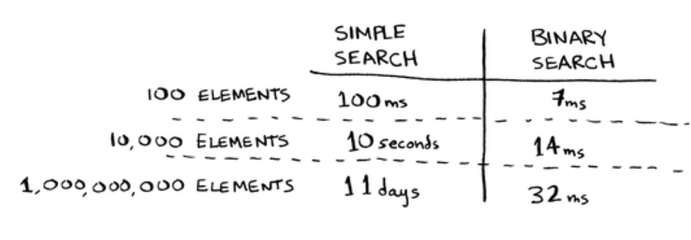

That is, as the number of items increases, binary search takes a little
more time to run. But simple search takes a lot more time to run. So
as the list of numbers gets bigger, binary search suddenly becomes a
lot faster than simple search. Bob thought binary search was 15 times
faster than simple search, but that’s not correct. If the list has 1 billion
items, it’s more like 33 million times faster. That’s why it’s not enough
to know how long an algorithm takes to run—you need to know how
the running time increases as the list size increases. That’s where Big O
notation comes in.

Big O notation tells you how fast an algorithm is. For example, suppose
you have a list of size n. Simple search needs to check each element, so
it will take n operations. The run time in Big O notation is O(n). Where
are the seconds? There are none—Big O doesn’t tell you the speed in
seconds. Big O notation lets you compare the number of operations. It
tells you how fast the algorithm grows.

Here’s another example. Binary search needs log n operations to check
a list of size n. What’s the running time in Big O notation? It’s O(log n).
In general, Big O notation is written as follows.

This tells you the number of operations an algorithm will make. It’s
called Big O notation because you put a “big O” in front of the number
of operations (it sounds like a joke, but it’s true!).

Here are five Big O run times that you’ll encounter a lot, sorted from
fastest to slowest:

• O(log n), also known as log time. Example: Binary search.

• O(n), also known as linear time. Example: Simple search.

• O(n * log n). Example: A fast sorting algorithm, like quicksort.

• O(n2). Example: A slow sorting algorithm, like selection sort.

• O(n!). Example: A really slow algorithm, like the traveling salesperson.

Here’s how long it would take to draw a grid for the rest of the
algorithms, from fastest to slowest:

