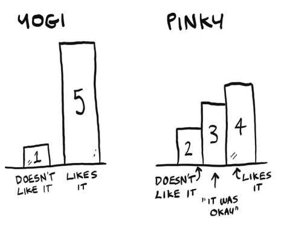

# EXERCISES
## 12.1
In the Netflix example, you calculated the distance between two different users using the distance formula. But not all users rate movies the same way. Suppose you have two users, Yogi and Pinky, who have the same taste in movies. But Yogi rates any movie he likes as a 5, whereas Pinky is choosier and reserves the 5s for only the best. They’re well matched, but according to the distance algorithm, they aren’t neighbors. How would you take their
different rating strategies into account?

## 12.2
Suppose Netflix nominates a group of “influencers.” For example, Quentin Tarantino and Wes Anderson are influencers on Netflix, so their ratings count for more than a normal user’s. How would you change the recommendations system so it’s biased toward the ratings of influencers?

## 12.3
Netflix has millions of users. The earlier example looked at the five closest neighbors for building the recommendations system. Is this too low? Too high?

