The KNN algorithm is simple but useful! If you’re trying to classify something, you might want to try KNN first. Let’s look at a more realworld example.

# Building a recommendations system

Suppose you’re Netflix, and you want to build a movie recommendations system for your users. You can plot every user on a graph.

These users are plotted by similarity, so users with similar taste are plotted closer together. Suppose you want to recommend movies for Priyanka. Find the five users closest to her.

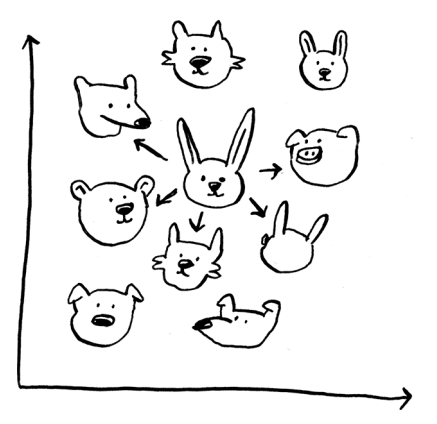

Once you have this graph, building a recommendations system is easy.
If Justin likes a movie, recommend it to Priyanka.

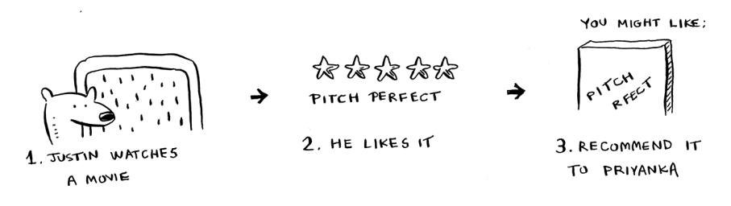

But there’s still a big piece missing. You graphed the users by similarity.
How do you figure out how similar two users are?

## Feature extraction

Size and color are the features you’re comparing. Now suppose you have three fruit. You can extract the features.

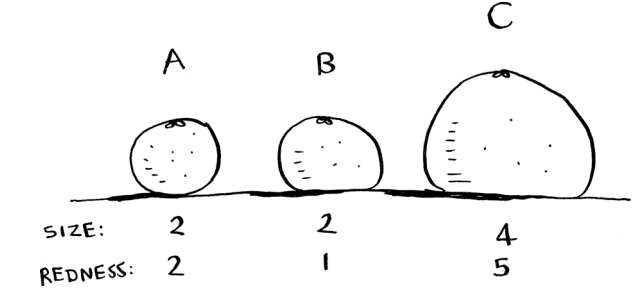

Then you can graph the three fruit.

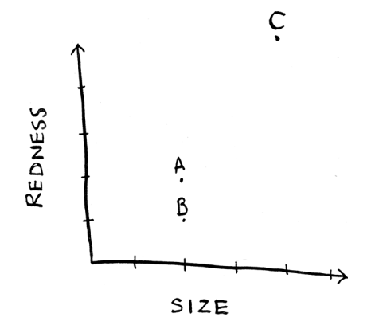

From the graph, you can tell visually that fruits A and B are similar. Let’s measure how close they are. To find the distance between two points, you use the Pythagorean formula.

$\sqrt{(x_1-x_2)^2 + (y_1-y_2)^2}$

Here’s the distance between A and B, for example.

$\sqrt{(2-2)^2 + (2-1)^2}$

$\sqrt{1} = 1$

The distance between A and B is 1. You can find the rest of the distances, too.

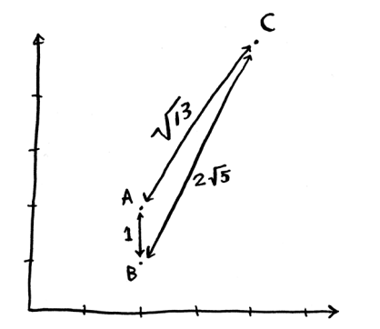

Suppose you’re comparing Netflix users instead. You need some way to graph the users. So, you need to convert each user to a set of coordinates, just as you did for fruit.

Once you can graph users, you can measure the distance between them.

Here’s how you can convert users into a set of numbers. When users sign up for Netflix, have them rate some categories of movies based on how much they like those categories. For each user, you now have a set of ratings!

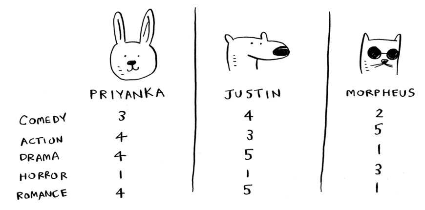

Priyanka and Justin like Romance and hate Horror. Morpheus likes Action but hates Romance (he hates it when a good action movie gets ruined by a cheesy romantic scene). Remember how, in oranges versus grapefruit, each fruit was represented by a set of two numbers? Here, each user is represented by a set of five numbers.

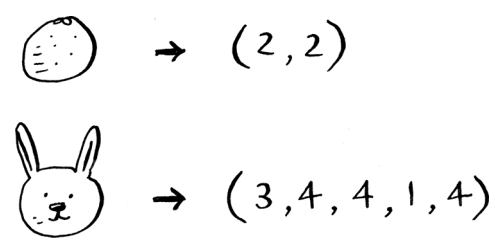

A mathematician would say instead of calculating the distance in two dimensions, you’re now calculating the distance in five dimensions. But the distance formula remains the same.

$\sqrt{(a_1-a_2)^2 + (b_1-b_2)^2+ (c_1-c_2)^2+ (d_1-d_2)^2+ (e_1-e_2)^2}$

It just involves a set of five numbers instead of a set of two numbers. The distance formula is flexible: you could have a set of a million numbers and still use the same old distance formula to find the distance. Maybe you’re wondering, “What does distance mean when you have five numbers?” The distance tells you how similar those sets of
numbers are.

**Note**
> By the way, here’s a bit of terminology you’ll see often. Those arrays of numbers like (2, 2) for the grapefruit or (3, 4, 4, 1, 4) for Priyanka’s taste in movies are called vectors. So if you’re reading a paper on machine learning, and you see the authors talking about vectors, they mean an array of numbers like that.

Great! Now recommending movies to Priyanka is easy: if Justin likes a movie, recommend it to Priyanka, and vice versa. You just built a movie recommendations system!

If you’re a Netflix user, Netflix will keep telling you, “Please rate more movies. The more movies you rate, the better your recommendations will be.” Now you know why. The more movies you rate, the more accurately Netflix can see what other users you’re similar to.

## Regression

Suppose you want to do more than just recommend a movie: you want to guess how Priyanka will rate this movie. Take the five people closest to her.


By the way, I keep talking about the closest five people. There’s nothing special about the number 5: you could do the closest 2, or 10, or 10,000.
That’s why the algorithm is called k-nearest neighbors and not fivenearest neighbors!

Suppose you’re trying to guess a rating for Pitch Perfect. Well, how did Justin, JC, Joey, Lance, and Chris rate it?

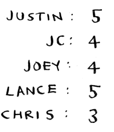

You could take the average of their ratings and get 4.2 stars. That’s called regression. These are the two basic things you’ll do with KNN—classification and regression:

- Classification = categorization into a group
- Regression = predicting a response (like a number)

Regression is very useful. Suppose you run a small bakery in Berkeley, and you make fresh bread every day. You’re trying to predict how many loaves to make for today. You have a set of features:

- Weather on a scale of 1 to 5 (1 = bad, 5 = great).
- Weekend or holiday? (1 if it’s a weekend or a holiday, 0 otherwise.)
- Is there a game on? (1 if yes, 0 if no.)

And you know how many loaves of bread you’ve sold in the
past for different sets of features.

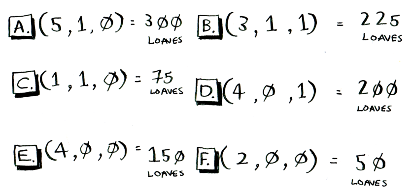

Today is a weekend day with good weather. Based on the data you just saw, how many loaves will you sell? Let’s use KNN, where k = 4. First, figure out the four nearest neighbors for this point.

```
(4, 1, 0) = ?
```

Here are the distances. A, B, D, and E are the closest.

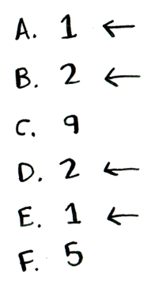

Take an average of the loaves sold on those days, and you get 218.75.
That’s how many loaves you should make for today!

### Cosine similarity

So far, you’ve been using the distance formula to compare the distance between two users. Is this the best formula to use? A common one used in practice is cosine similarity. Suppose two users are similar, but one is more conservative in their ratings. They both loved Manmohan Desai’s Amar
Akbar Anthony. Paul rated it 5 stars, but Rowan rated it 4 stars. If you keep using the distance formula, these two users might not be each other’s neighbors, even though they have similar taste.

Cosine similarity doesn’t measure the distance between two vectors.
Instead, it compares the angles of the two vectors. It’s better at dealing with cases like this. Cosine similarity is out of the scope of this book, but look it up if you use KNN!

## Picking good features

To figure out recommendations, you had users rate categories of movies. What if you had them rate pictures of cats instead? Then you’d find users who rated those pictures similarly. This would probably be a worse recommendations engine because the “features” don’t have a lot to do with taste in movies!

When you’re working with KNN, it’s really important to pick the right features to compare against. Picking the right features means

- Features that directly correlate to the movies you’re trying to recommend
- Features that don’t have a bias (for example, if you ask the users to only rate comedy movies, that doesn’t tell you whether they like action movies)

Do you think ratings are a good way to recommend movies? Maybe I rated Inception more highly than Legally Blonde, but I actually spend more time watching Legally Blonde. How would you improve this Netflix recommendations system?

# Introduction to machine learning

KNN is a really useful algorithm, and it’s your introduction to the magical world of machine learning! Machine learning is all about making your computer more intelligent. You already saw one example of machine learning: building a recommendations system. 

## OCR

OCR stands for optical character recognition. It means you can take a photo of a page of text, and your computer will automatically read the text for you.

For example, consider this number: **7**

How would you automatically figure out what number this is? You can use KNN for this:
1. Go through a lot of images of numbers and extract features of those numbers.
2. When you get a new image, extract the features of that image and see what its nearest neighbors are!

Generally speaking, OCR algorithms measure lines, points, and curves.

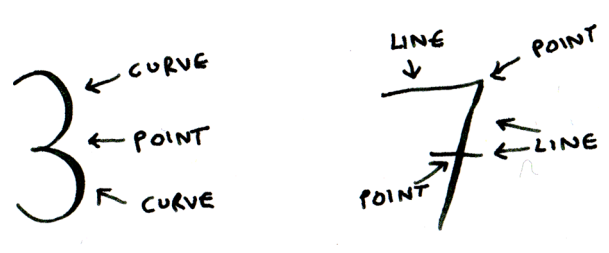

Then, when you get a new character, you can extract the same features from it.

Feature extraction is a lot more complicated in OCR than the fruit example. But it’s important to understand that even complex technologies build on simple ideas, like KNN. You could use the same ideas for speech recognition or face recognition. When you upload a photo to Facebook, sometimes it’s smart enough to tag people in the photo automatically. That’s machine learning in action!

The first step of OCR, where you go through images of numbers and extract features, is called—wait for it—*feature extraction*. This is where you transform the images into something that your machine learning algorithm can work with. The next step is called *training*, where you train a model on your features so it can recognize numbers in images.
Most machine-learning algorithms have a training step: before your computer can do the task, it must be trained. The next example involves spam filters, and it has a training step.

## Building a spam filter

Spam filters use another simple algorithm called the *Naive Bayes classifier*. First, you train your Naive Bayes classifier on some data.

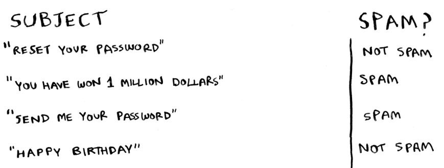

Suppose you get an email with the subject “Сollect your million dollars now!” Is it spam? You can break this sentence into words. Then, for each word, see what the probability is for that word to show up in a spam email. For example, in this very simple model, the word million only appears in spam emails. Naive Bayes figures out the probability that something is likely to be spam. It has applications similar to KNN. For example, you could use Naive Bayes to categorize fruit: you have a fruit that’s big and red. What’s the probability that it’s a grapefruit? It’s another simple algorithm that’s fairly effective. We
love those algorithms!

## Predicting the stock market

Here’s something that’s hard to do with machine learning:
predicting whether the stock market will go up or down. How
do you pick good features in a stock market? Suppose you say
that if the stock went up yesterday, it will go up today. Is that
a good feature? Or suppose you say that the stock will always
go down in May. Will that work? There’s no guaranteed way
to use past numbers to predict future performance. Predicting
the future is hard, and it’s almost impossible when there are so
many variables involved.

# A high-level overview of training an ML model

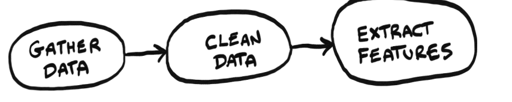

Now that we’ve seen a few examples, let’s look at the steps to training an ML model. First gather the data. In the Netflix example, our data was movie ratings from users. Then you need to clean the data. Cleaning means getting rid of bad data. For example, you may have users who don’t like being prompted to rate movies, so they rate movies randomly and move to the next screen. You will want to remove this data from your data set. You will then need to extract features from your data.

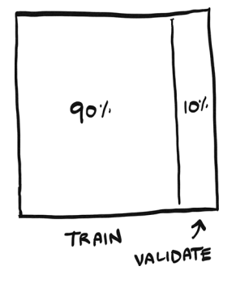

After you have your features, it’s time to train your model. Select a model like KNN, SVM’s, or a neural network and train it with 90% of your data. Keep the remaining 10% to validate the model. After your model is trained, you will test it by asking it to make a prediction. You can use that 10% of data to see how good that prediction is.

For example, let’s say we want to test the Netflix recommendations model. We can ask it how Priyanka would like these movies and shows:

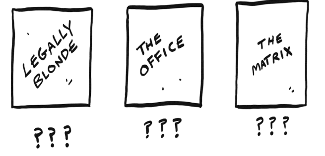

Our model comes back with its predictions.

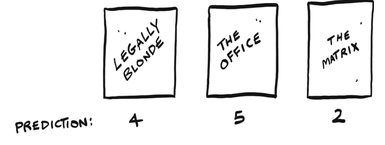

We know which movies Priyanka likes -- that was part of the 10% of data we held back. We can compare that against the model’s predictions.

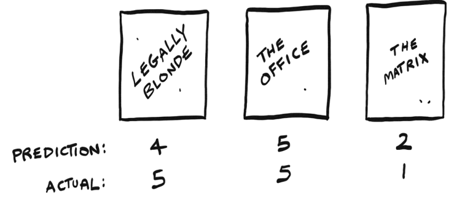

Not bad! In that case we can say the model made a good prediction, because the numbers are pretty close to Priyanka’s actual ratings. This step of testing the model is called validating or evaluating the model.

After evaluating the model, we may want to go back and adjust it. For example, let’s say we’ve built a KNN model where K = five. We may want to try it with K = seven to see if it gives better results. This is called parameter tuning.
After you’re done training and evaluating the model, you have a model ready to go! These are the steps in building an ML model at a high level.

# Recap
I hope this gives you an idea of all the different things you can do with KNN and with machine learning! Machine learning is an interesting field that you can go pretty deep into if you decide to.

- KNN is used for classification and regression and involves looking at the k-nearest neighbors.
- Classification = categorization into a group.
- Regression = predicting a response (like a number).
- Feature extraction means converting an item (like a fruit or a user) into a list of numbers that can be compared.
- Picking good features is an important part of a successful KNN algorithm.