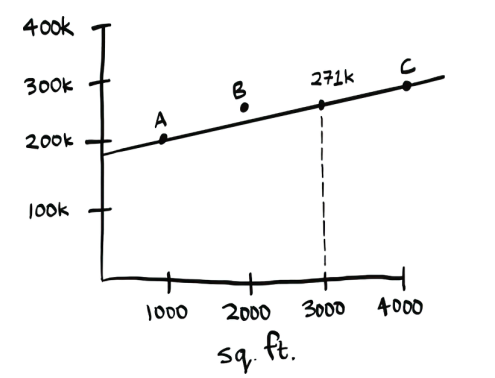

# Linear regression

Suppose you need to sell your house. It is 3,000 ft². You look at the homes recently sold in your neighborhood.

Based on this information, how would you price your house? Here’s one way you could do it. Plot all the points. Then eyeball a line through these points.

Now you can see where 3000 ft² lands on that line, and that would be a
pretty good starting price for your home:

This is how linear regression works. Given a bunch of points, it tries to fit a line to them, and then you can use that line to make predictions. Linear regression has been used in statistics for a long time, and now it is being widely used in machine learning because it is an easy first technique to try. It is useful if your values are continuous. If you are trying to predict something, linear regression might be a good place
to start.

# Inverted indexes

Here’s a very simplified version of how a search engine works. Suppose you have three web pages with this simple content.

Let’s build a hash table from this content. The keys of the hash table are the words, and the values tell you what pages each word appears on. Now suppose a user searches for hi. Let’s see what pages hi shows up on.

Aha! It appears on pages A and B. Let’s show the user those pages as the result. Or suppose the user searches for there. Well, you know that it shows up on pages A and C. Pretty easy, huh? This is a useful data structure: a hash that maps words to places where they appear. This data structure is called an inverted index, and it’s commonly used to build search engines. If you’re interested in search, this is a good place
to start.

# The Fourier transform

The Fourier transform is one of those rare algorithms: brilliant, elegant, and with a million use cases. The best analogy for the Fourier transform comes from Better Explained (a great website that explains math simply): given a smoothie, the Fourier transform will tell you the ingredients in the smoothie.1 Or, to put it another way, given a song, the
transform can separate it into individual frequencies.

It turns out that this simple idea has a lot of use cases. For example, if you can separate a song into frequencies, you can boost the ones you care about. You could boost the bass and hide the treble. The Fourier transform is great for processing signals. You can also use it to compress music. First, you break an audio file down into its ingredient notes. The Fourier transform tells you exactly how much each note contributes to the overall song. So you can get rid of the notes that aren’t important. That’s how the MP3 format works!

Music isn’t the only type of digital signal. The JPG format is another compressed format, and it works the same way. People use the Fourier transform to try to predict upcoming earthquakes and analyze DNA. You can use it to build an app like Shazam, which guesses what song is playing. The Fourier transform has a lot of uses. Chances are high that
you’ll run into it!

# Parallel algorithms

To make your algorithms faster, you need to change them to run in parallel across all the cores at once!

Here’s a simple example. The best you can do with a sorting algorithm is roughly $O(n log n)$. It’s well known that you can’t sort an array in $O(n)$ time—unless you use a parallel algorithm! There’s a parallel version of quicksort that will sort an array in $O(n)$ time.

Parallel algorithms are hard to design. And it’s hard to make sure they work correctly and to figure out what type of speed boost you’ll see.

One thing is for sure—the time gains aren’t linear. So if you have two cores in your laptop instead of one, that almost never means your algorithm will magically run twice as fast. There are a couple of reasons for this:

- *Overhead of managing the parallelism*—Suppose you have to sort an array of 1,000 items. How do you divide this task between the two cores? Do you give each core 500 items to sort and then merge the two sorted arrays into one big sorted array? Merging the two arrays takes time.
- *Amdahl’s law*—Suppose you are painting a picture. Paintings take you very long to do, typically 20 hours. Ideally, you would do it in 10 hours. You decide to optimize your process. You break it down into two steps: (i) doing the initial sketch and (ii) painting it. For the initial sketch, instead of free-handing it, surely tracing will be faster. But the next time you paint, it still takes 19 hours and 5 minutes! What happened? Well, the sketch used to take an hour. You’ve got it down to 5 minutes, which is a big improvement. But the painting is the part that took the most time, and you didn’t optimize that at all.

This is Amdahl’s law. Amdahl’s law says that when you optimize one part of the system, the performance gain is limited by how much time that part actually takes. In this case, we cut the sketch time to 1/12th of what it used to be. In the process, we saved 55 minutes. If we could have cut the painting time by the same amount, we would have saved 1,045 minutes! When you are speeding up your algorithm by parallelizing it, think about which part to parallelize. Are you parallelizing the painting part or the sketching part?

- *Load balancing*—Suppose you have 10 tasks to do, so you give each core five tasks. But core A gets all the easy tasks, so it’s done in 10 seconds, whereas core B gets all the hard tasks, so it takes a minute.

That means core A was sitting idle for 50 seconds while core B was doing all the work! How do you distribute the work evenly so both cores are working equally hard?

# map/reduce

There’s a special type of parallel algorithm that is becoming increasingly popular: *the distributed algorithm*. It’s fine to run a parallel algorithm on your laptop if you need two to four cores, but what if you need hundreds of cores? Then you can write your algorithm to run across multiple machines. Google popularized a distributed algorithm that they called MapReduce, but these functions have been around for longer.

Why are distributed algorithms useful? Suppose you have a table with billions or trillions of rows, and you want to run a complicated SQL query on it. You can’t run it on MySQL because it struggles after a few billion rows. Use map/reduce!

Or suppose you have to process a long list of jobs. Each job takes 10 seconds to process, and you need to process 1 million jobs like this. If you do this on one machine, it will take you months! If you could run it across 100 machines, you might be done in a few days.

Distributed algorithms are great when you have a lot of work to do and want to speed up the time required to do it.

# Bloom filters and HyperLogLog

Suppose you’re running Reddit. When someone posts a link, you want to see if it’s been posted before. Stories that haven’t been posted before are considered more valuable. So you need to figure out whether this link has been posted before.

Or suppose you’re Google, and you’re crawling web pages. You only want to crawl a web page if you haven’t crawled it already. So you need to figure out whether this page has been crawled before.

Or suppose you’re running bit.ly, which is a URL shortener. You don’t want to redirect users to malicious websites. You have a set of URLs that are considered malicious. Now you need to figure out whether you’re redirecting the user to a URL in that set.

All of these examples have the same problem. **You have a very large set**.

Now you have a new item, and you want to see whether it belongs in that set. You could do this quickly with a hash. For example, suppose Google has a big hash in which the keys are all the pages it has crawled.

You want to see whether you’ve already crawled adit.io. Look it up in the hash.

`adit.io` is a key in the hash, so you’ve already crawled it. The average lookup time for hash tables is O(1). adit.io is in the hash, so you’ve already crawled it. You found that out in constant time. Pretty good!

Except that this hash needs to be huge. Google indexes trillions of web pages. If this hash has all the URLs that Google has indexed, it will take up a lot of space. Reddit and bit.ly have the same space problem. When you have so much data, you need to get creative!

## Bloom filters

Bloom filters offer a solution. Bloom filters are *probabilistic data structures*. They give you an answer that could be wrong but is probably correct. Instead of a hash, you can ask your bloom filter if you’ve crawled this URL before. A hash table would give you an accurate answer. A bloom filter will give you an answer that’s probably correct:

- False positives are possible. Google might say, “You’ve already crawled this site,” even though you haven’t.
- False negatives aren’t possible. If the bloom filter says, “You haven’t crawled this site,” then you *definitely* haven’t crawled this site.

Bloom filters are great because they take up very little space. A hash table would have to store every URL crawled by Google, but a bloom filter doesn’t have to do that. They’re great when you don’t need an exact answer, as in all of these examples. It’s OK for bit.ly to say, “We think
this site might be malicious, so be extra careful."

## HyperLogLog

Along the same lines is another algorithm called HyperLogLog. Suppose Google wants to count the number of unique searches performed by its users. Or suppose Amazon wants to count the number of unique items that users looked at today. Answering these questions takes a lot of space! With Google, you’d have to keep a log of all the unique searches. When a user searches for something, you have to see whether it’s already in the log. If not, you have to add it to the log. Even for a single day, this log would be massive!

HyperLogLog approximates the number of unique elements in a set. Just like bloom filters, it won’t give you an exact answer, but it comes very close and uses only a fraction of the memory a task like this would otherwise take. If you have a lot of data and are satisfied with approximate answers, check out probabilistic algorithms!

# HTTPS and the Diffie–Hellman key exchange

When you send some data to a server, your browser encrypts the message for you, and then the server decrypts it. Simple, right? Except for one thing: How do you make sure your browser and the server have the same key?

Remember that for HTTPS to work, both sides need to have the same key. But how do you agree on a key without someone seeing what it is? If you send the server a key to use, someone could intercept that key. How do you agree on a key so that only your browser and the server know what key you’re using? This seems impossible, but it can be done!
There’s a very clever algorithm to do it called the Diffie–Hellman key exchange. Here’s how it works.

In step 1, we generate our own keys. I’m the client, and I generate a key for myself. The server also generates a key. These keys are different. We don’t know each other’s keys. They are private to us.

I’m using a pattern here for each key so I can show you visually what happens. In reality, these would be bytes.
In step 2, we generate a common pattern.

This pattern is public. Both of us can see it as well as anyone else. We don’t care who sees it.

In step 3, we each overlay this pattern onto our private key.

Doing so gives us our public key. The public key is, well, public, so we don’t care who sees it. The server can see my public key, and I can see its public key.
Finally, in step 4, I take the server’s public key and overlay it onto my private key. And the server does the same with my public key.

Tada! We now have the same key! We both have a key that combines three patterns.

Somehow we have both agreed on a key without ever sending the key to each other. This key we have agreed on is called the *shared secret*, and that’s how the Diffie–Hellman key exchange works.

HTTPS is a fascinating and important part of our daily lives. Here are some terms you’ll hear about in connection to HTTPS:

- *TLS*—TLS (Transport Layer Security) is a protocol. TLS is how we establish this secure connection.
- *SSL*—SSL is the old name for TLS, but people often don’t make a distinction. If you hear someone say SSL, they are probably talking about TLS. People find security holes in these protocols, so they constantly need to be updated. The TLS protocol was first introduced in 1999. Every version of the SSL protocol that came before the TLS protocol is broken.
- *Symmetric key encryption*—In our example, both sides used the same key. There is also something called *asymmetric key encryption*, where both sides have different keys. I talked about symmetric key encryption because that is what HTTPS uses.

HTTPS uses a modified version of the Diffie–Hellman key exchange called the *ephemeral Diffie–Hellman key exchange*. It works exactly like we just saw, except the private keys are generated fresh for every connection. This means even if an attacker discovers one of the private keys, they can only decrypt the messages from one connection.

# Locality-sensitive hashing

A lot of hash functions you use will be locality insensitive. Suppose you have a string, and you generate a hash for it using SHA-256. If you change just one character of the string and regenerate the hash, it’s totally different!

This is good because an attacker can’t compare hashes to see whether they’re close to cracking a password.

Sometimes, you want the opposite: you want a locality-sensitive hash function. That’s where *Simhash* comes in. If you make a small change to a string, Simhash generates a hash that’s only a little different. This allows you to compare hashes and see how similar two strings are, which is pretty useful!
- Google uses Simhash to detect duplicates while crawling the web.
- A teacher could use Simhash to see whether a student copied an essay from the web.

Scribd allows users to upload documents or books to share with others. But Scribd doesn’t want users uploading copyrighted content! The site could use Simhash to check whether an upload is similar to a Harry Potter book and, if so, reject it automatically. Simhash is useful when you want to check for similar items.

# Min heaps and priority queues

Min heaps are a data structure built using trees. These heaps store a bunch of numbers. Here is an example of a min heap.

Min heaps let you get the smallest element in the heap quickly since the smallest value is always the root. This is the main usefulness of the min heap. You can look at the smallest element in O(1) time.

Or, in $O(log n)$ time, you can remove it from the heap with a new min in its place:

Heaps let you sort very easily. Keep asking for the minimum value.

And keep putting the values in order. At the end, the tree will be empty, and you will have a sorted list of numbers! This algorithm is called **heapsort**.

Max heaps are very similar to min heaps, but now the root is the largest value.

> Heaps are great for implementing priority queues.

Remember that queues are a FIFO (first in, first out) data structure. (In contrast, a stack is a LIFO [last in, first out] data structure.) Well, a priority queue is just like a queue, except when you ask for an item, it gives you the item with the highest priority! A to-do list application is a great use case for a priority queue. First, you put in your to-dos. Then you ask for something to work on, and your priority queue gives you the next highest priority to-do. Priority queues are also used to implement an efficient version of Dijkstra’s algorithm.

# Linear programming

Linear programming is used to maximize something given some linear constraints. For example, suppose your company makes two products, shirts and totes. Shirts need 1 m of fabric and five buttons. Totes need 2 m of fabric and two buttons. You have 11 meters of fabric and 20 buttons. You make $2 per shirt and $3 per tote. How many shirts and totes should you make to maximize your profit?

Here you’re trying to maximize profit, and you’re constrained by the amount of materials you have.

Another example: you’re a politician, and you want to maximize the number of votes you get. Your research has shown that it takes an average of 1 hour of work (marketing, research, and so on) for each vote from a San Franciscan or 1.5 hours/vote from a Chicagoan. You need at least 500 San Franciscans and at least 300 Chicagoans. You have 50 days.

It costs you $2/San Franciscan versus $1/Chicagoan. Your total budget is $1,500. What’s the maximum number of total votes you can get (San Francisco + Chicago)?

Here you’re trying to maximize votes, and you’re constrained by time and money.

You might be thinking, “You’ve talked about a lot of optimization topics in this book. How are they related to linear programming?” All the graph algorithms we have discussed in this book can be done through linear programming instead. Linear programming is a much more general framework, and the graph problems we have seen are a subset of that. I hope your mind is blown!

Linear programming uses the Simplex algorithm. It’s a complex algorithm, which is why I didn’t include it in this book. If you’re interested in optimization, look up linear programming!

