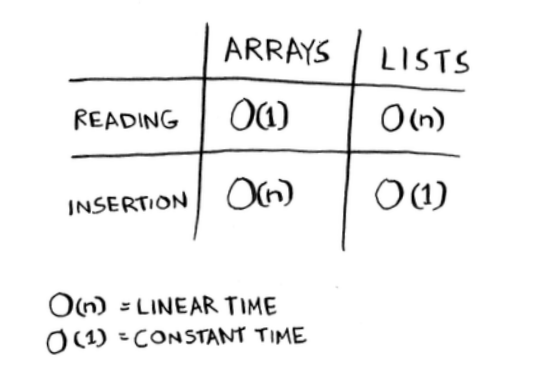
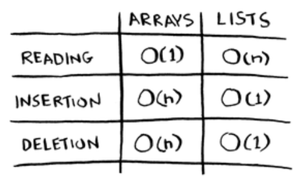
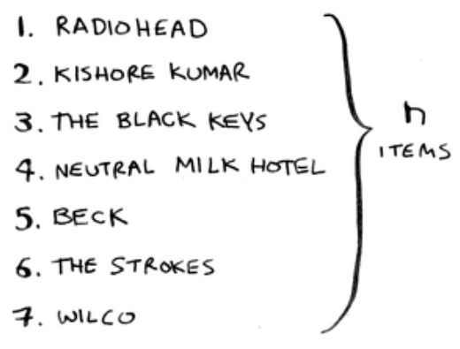
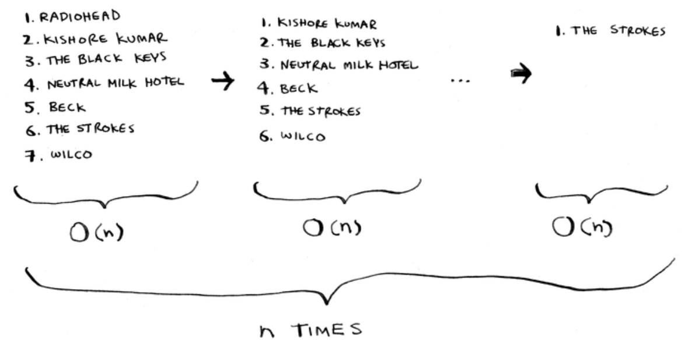

Here are the run times for common operations on arrays and lists.

What’s better if you want to insert elements in the middle: arrays or lists? With lists, it’s as easy as changing what the previous element points to.

But for arrays, you have to shift all the rest of the elements down.

And if there’s no space, you might have to copy everything to a new location! Lists are better if you want to insert elements into the middle.

-----

Here are the run times for common operations on arrays and
linked lists.

It’s worth mentioning that insertions and deletions are O(1) time only if you can instantly access the element to be deleted. It’s a common practice to keep track of the first and last items in a linked list, so it would take only O(1) time to delete those.

Which are used more: arrays or lists? Obviously, it depends on the use
case. But arrays see a lot of use because they allow random access. There
are two different types of access: random access and sequential access.
Sequential access means reading the elements one by one, starting
at the first element. Linked lists can only do sequential access. If you
want to read the 10th element of a linked list, you have to read the first
9 elements and follow the links to the 10th element. Random access
means you can jump directly to the 10th element. You’ll frequently
hear me say that arrays are faster at reads. This is because they provide
random access. A lot of use cases require random access, so arrays are
used a lot. Arrays and lists are used to implement other data structures,
too (coming up later in the book).

----

Let’s put on our computer science hats and see how long this will take to run. Remember that O(n) time means you touch every element in a list once. For example, running simple search over the list of artists means
looking at each artist once.

To find the artist with the highest play count, you have to check each item in the list. This takes O(n) time, as you just saw. So you have an operation that takes O(n) time, and you have to do that n times:

This takes $O(n × n)$ time or $O(n^2)$ time.

Sorting algorithms are very useful. Now you can sort

    • Names in a phone book

    • Travel dates

    • Emails (newest to oldest)

## Recap

• Your computer’s memory is like a giant set of drawers.

• When you want to store multiple elements, use an array or a list.

• With an array, all your elements are stored right next to each other.

• With a list, elements are strewn all over, and one element stores the address of the next one.

• Arrays allow fast reads.

• Linked lists allow fast inserts and deletes.

• All elements in the array should be the same type (all ints, all doubles, and so on).