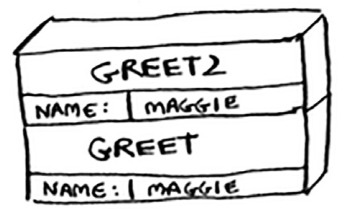

# EXERCISE

## 3.1

Suppose I show you a call stack like this.

What information can you give me, just based on this call stack?
Now let’s see the call stack in action with a recursive function.

My answer: Function starts with great but it call great2 before end to call greet.
After greet2 is pop off, greet can end the call.

Book answer:

## 3.2

Suppose you accidentally write a recursive function that runs forever. As you saw, your computer allocates memory on the
stack for each function call. What happens to the stack when your recursive function runs forever?

My answer: Occurs the famous Stack overflow.

Book answer:

