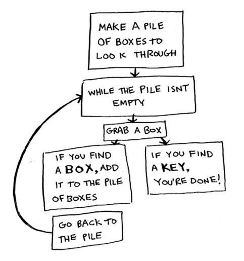
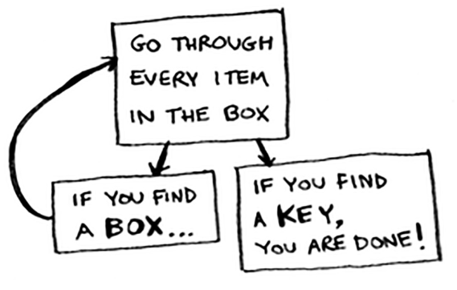
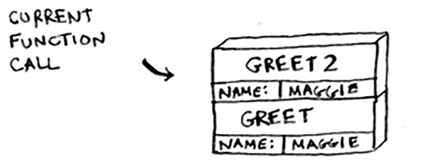
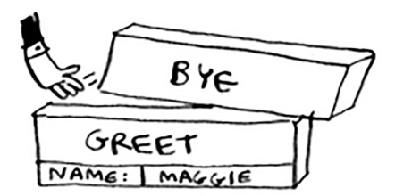

# Recursion

Here’s one approach.



1. Make a pile of boxes to look through.
2. Grab a box, and look through it.
3. If you find a box, add it to the pile to look through later.
4. If you find a key, you’re done!
5. Repeat.

Here’s an alternate approach.



1. Look through the box.
2. If you find a box, go to step 1.
3. If you find a key, you’re done!

> “Loops may achieve a performance gain for
your program. Recursion may achieve a performance gain for your
programmer. Choose which is more important in your situation!” - Leigh Caldwell
on Stack Overflow

When you write a recursive function, you have to tell it when to stop
recursing. That’s why every recursive function has two parts: the base
case, and the recursive case. The recursive case is when the function calls
itself. The base case is when the function doesn’t call itself again … so it
doesn’t go into an infinite loop.

> The call stack is an important concept in
general programming, and it’s also important to understand
when using recursion.

## Example 

Suppose you’re throwing a barbecue. You keep a todo list for the
barbecue, in the form of a stack of sticky notes.
Remember back when we talked about arrays and lists,
and you had a todo list? You could add todo items
anywhere to the list or delete random items. The stack of
sticky notes is much simpler. When you insert an item,
it gets added to the top of the list. When you read an item,
you only read the topmost item, and it’s taken off the list. So your todo
list has only two actions: push (insert) and pop (remove and read).

This data structure is called a stack. The stack is a simple data structure.
You’ve been using a stack this whole time without realizing it!

# The call stack

Your computer uses a stack internally called the call stack. Let’s see it in
action. Here’s a simple function:

```python
def greet(name):
    print “hello, “ + name + “!”
    greet2(name)
    print “getting ready to say bye...”
    bye()

def greet2(name):
    print “how are you, “ + name + “?”

def bye():
    print “ok bye!”
```

Let’s walk through what happens when you call a function.

Suppose you call greet(“maggie”). First, your computer allocates a box
of memory for that function call.

Now let’s use the memory. The variable name is set to “maggie”. That
needs to be saved in memory.

Every time you make a function call, your computer saves the values
for all the variables for that call in memory like this. Next, you print
hello, maggie! Then you call greet2(“maggie”). Again, your
computer allocates a box of memory for this function call.



Your computer is using a stack for these boxes. The second box is added
on top of the first one. You print how are you, maggie? Then you
return from the function call. When this happens, the box on top of the
stack gets popped off.

Now the topmost box on the stack is for the greet function, which
means you returned back to the greet function. When you called the
greet2 function, the greet function was partially completed. This is
the big idea behind this section: when you call a function from another
function, the calling function is paused in a partially completed state. All
the values of the variables for that function are still stored in memory.
Now that you’re done with the greet2 function, you’re back to the
greet function, and you pick up where you left off. First you print
getting ready to say bye…. You call the bye function.

A box for that function is added to the top of the stack. Then you print
ok bye! and return from the function call.



And you’re back to the greet function. There’s nothing else to be done,
so you return from the greet function too. This stack, used to save the
variables for multiple functions, is called the call stack.

> Recursive functions use the call stack too!

Using the stack is convenient, but there’s a cost: saving all that info can
take up a lot of memory. Each of those function calls takes up some
memory, and when your stack is too tall, that means your computer is
saving information for many function calls. At that point, you have two
options:

- You can rewrite your code to use a loop instead.
- You can use something called tail recursion. That’s an advanced recursion topic that is out of the scope of this book. It’s also only supported by some languages, not all.

## Recap

- Recursion is when a function calls itself.
- Every recursive function has two cases: the base case
and the recursive case.
- A stack has two operations: push and pop.
- All function calls go onto the call stack.
- The call stack can get very large, which takes up a lot of memory.