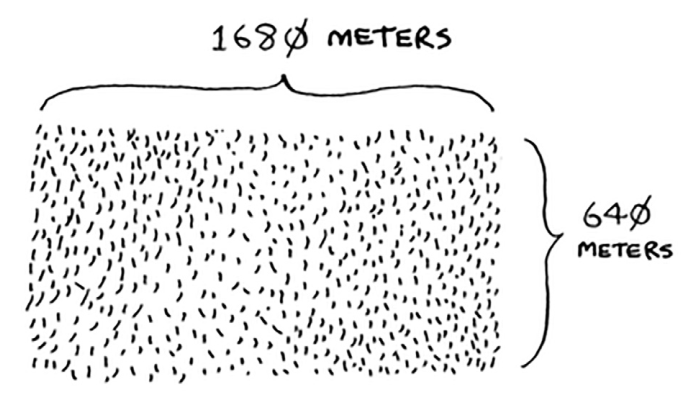
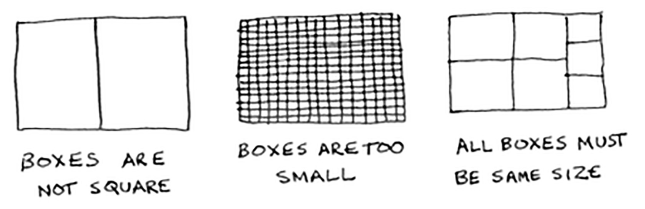
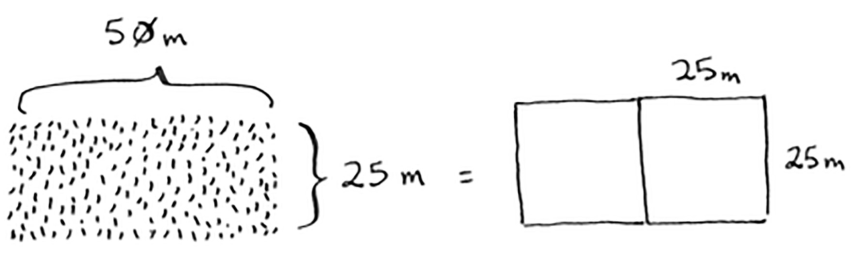
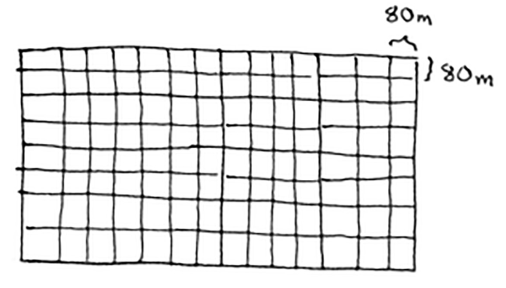
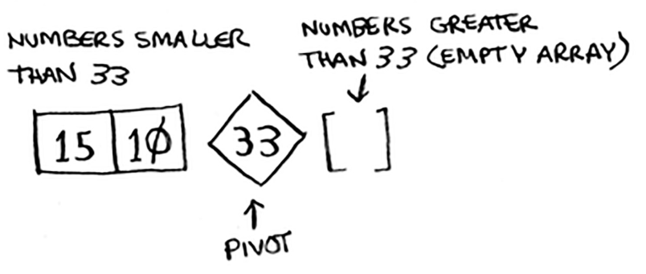

When you get a new problem, you don’t have to be stumped. Instead, you can ask, “Can I solve this if I use divide and conquer?”

D&C can take some time to grasp. So, we’ll do three
examples. 

Suppose you’re a farmer with a plot of land.



You want to divide this farm evenly into square plots. You want the plots to be as big as possible. So none of these will work.



To solve a problem using D&C, there are two steps:

1. Figure out the base case. This should be the simplest possible case.
2. Divide or decrease your problem until it becomes the base case.

Let’s use D&C to find the solution to this problem. What is the largest square size you can use?

First, figure out the base case. The easiest case would be if one side was a multiple of the other side.



Suppose one side is 25 meters (m) and the other side is 50 m. Then the largest box you can use is 25 m × 25 m. You need two of those boxes to divide up the land.

According to D&C, with every recursive call, you have to reduce your problem. How do you reduce the problem here? Let’s start by marking out the biggest boxes you can use.

You can fit two 640 × 640 boxes in there, and there’s some land still
left to be divided.

So you started out with a 1680 × 640 farm that needed to be split up.
But now you need to split up a smaller segment, 640 × 400. If you find
the biggest box that will work for this size, that will be the biggest box
that will work for the entire farm. You just reduced the problem from
a 1680 × 640 farm to a 640 × 400 farm!

Let’s apply the same algorithm again. Starting with a 640 × 400m farm, the biggest box you can create is 400 × 400 m. And that leaves you with a smaller segment, 400 × 240 m.

And you can draw a box on that to get an even smaller segment, 240 × 160 m.

And then you draw a box on that to get an even smaller segment.

Hey, you’re at the base case: 80 is a factor of 160. If you split up this
segment using boxes, you don’t have anything left over!

So, for the original farm, the biggest plot size you can use is 80 × 80 m.



To recap, here’s how D&C works:
1. Figure out a simple case as the base case.
2. Figure out how to reduce your problem and get to the base case.

**Euclid’s algorithm**

> “If you find the biggest box that will work for this size, that will be the
biggest box that will work for the entire farm.” If it’s not obvious to you
why this statement is true, don’t worry. It isn’t obvious. Unfortunately, the
proof for why it works is a little too long to include in this book, so you’ll
just have to believe me that it works. If you want to understand the proof,
look up Euclid’s algorithm. The Khan academy has a good explanation
here: https://www.khanacademy.org/computing/computer-science/
cryptography/modarithmetic/a/the-euclidean-algorithm.

**Tip**

> When you’re writing a recursive function involving an array, the base case is
often an empty array or an array with one element. If you’re stuck, try that first.

# Quicksort

Quicksort is a sorting algorithm. It’s much faster than selection sort and is frequently used in real life.

Here’s how quicksort works. First, pick an element from the array. This element is called the pivot.
We’ll talk about how to pick a good pivot later. For now,
let’s say the first item in the array is the pivot.

Now find the elements smaller than the pivot and the elements larger than the pivot.

This is called partitioning. Now you have

• A sub-array of all the numbers less than the pivot.

• The pivot

• A sub-array of all the numbers greater than the pivot



The two sub-arrays aren’t sorted. They’re just partitioned. But if they
were sorted, then sorting the whole array would be pretty easy.

If the sub-arrays are sorted, then you can combine the whole thing like this—left array + pivot + right array—and you get a sorted array. In this case, it’s [10, 15] + [33] + [] = [10, 15, 33], which is a sorted array.

How do you sort the sub-arrays? Well, the quicksort base case already
knows how to sort arrays of two elements (the left sub-array) and
empty arrays (the right sub-array). So if you call quicksort on the two
sub-arrays and then combine the results, you get a sorted array!

```sh
quicksort([15, 10]) + [33] + quicksort([])
> [10, 15, 33] A sorted array
```
This will work with any pivot. Suppose you choose 15 as the
pivot instead.

Both sub-arrays have only one element, and you know how to sort those. So now you know how to sort an array of three elements. Here are the steps:

1. Pick a pivot.
2. Partition the array into two sub-arrays: elements less than the pivot
and elements greater than the pivot.
3. Call quicksort recursively on the two sub-arrays.

This works with any element as the pivot. So you can sort an array of five elements. Using the same logic, you can sort an array of six elements, and so on.


**Inductive proofs**

> You just got a sneak peak into inductive proofs! Inductive proofs are one way to prove that your algorithm works. Each inductive proof has two steps: the base case and the inductive case. Sound familiar? For example,
suppose I want to prove that I can climb to the top of a ladder. In the inductive case, if my legs are on a rung, I can put my legs on the next rung.
So if I’m on rung 2, I can climb to rung 3. That’s the inductive case. For the base case, I’ll say that my legs are on rung 1. Therefore, I can climb the entire ladder, going up one rung at a time.

> You use similar reasoning for quicksort. In the base case, I showed that the algorithm works for the base case: arrays of size 0 and 1. In the inductive case, I showed that if quicksort works for an array of size 1, it will work
for an array of size 2. And if it works for arrays of size 2, it will work for arrays of size 3, and so on. Then I can say that quicksort will work for all arrays of any size. I won’t go deeper into inductive proofs here, but they’re
fun and go hand-in-hand with D&C.

Quicksort is unique because its speed depends on the pivot you choose.

# Recap

• D&C works by breaking a problem down into smaller and smaller pieces. If you’re using D&C on a list, the base case is probably an empty array or an array with one element.

• If you’re implementing quicksort, choose a random element as the pivot. The average runtime of quicksort is O(n log n)!

• The constant in Big O notation can matter sometimes. That’s why quicksort is faster than merge sort.

• The constant almost never matters for simple search versus binary search, because O(log n) is so much faster than O(n) when your list gets big.