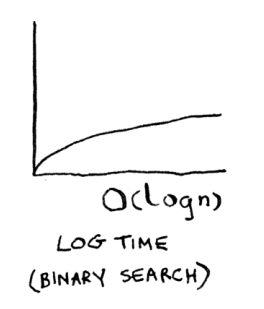

# Hash functions

> A hash function is a function where you put in a string1 and you get back a number.


In technical terminology, we’d say that a hash function “maps strings to numbers.” You might think there’s no discernable pattern to what number you get out when you put a string in. But there are some requirements for a hash function:

- It needs to be consistent. For example, suppose you put in “apple” and get back “4”. Every time you put in “apple”, you should get “4” back. Without this, your hash table won’t work.
- It should map different words to different numbers. For example, a hash function is no good if it always returns “1” for any word you put in. In the best case, every different word should map to a different number.

Start with an empty array:


You’ll store all of your prices in this array. Let’s add the price of an apple. Feed “apple” into the hash function.

The hash function outputs “3”. So let’s store the price of an apple at index 3 in the array.

Let’s add milk. Feed “milk” into the hash function.
The hash function says “0”. Let’s store the price of milk at index 0.


Keep going, and eventually the whole array will be full of prices.


The hash function tells you exactly where the price is stored, so you don’t have to search at all! This works because
- The hash function consistently maps a name to the same index. Every time you put in “avocado”, you’ll get the same number back. So you can use it the first time to find where to store the price of an avocado, and then you can use it to find where you stored that price.
- The hash function maps different strings to different indexes. “Avocado” maps to index 4. “Milk” maps to index 0. Everything maps to a different slot in the array where you can store its price.
- The hash function knows how big your array is and only returns valid indexes. So if your array is 5 items, the hash function doesn’t return 100 … that wouldn’t be a valid index in the array.

Put a hash function and an array together, and you get a data structure called a hash table. A hash table is the first data structure you’ll learn that has some extra logic behind it.Arrays and lists map straight to memory, but hash tables are smarter. They use a hash function to intelligently figure out where to store elements.

They’re also known as hash maps, maps, dictionaries, and associative arrays. And hash tables are fast!

> Python has hash tables; they’re called dictionaries. You can make a new hash table using the dict function:

```python
book = dict()

book[“apple”] = 0.67 # An apple costs 67 cents.
book[“milk”] = 1.49 # Milk costs $1.49.
book[“avocado”] = 1.49
print(book)
# {‘avocado’: 1.49, ‘apple’: 0.67, ‘milk’: 1.49}

print(book[“avocado”])
#1.49 <- The price of an avocado
```

A hash table has keys and values. In the book hash, the names of produce are the keys, and their prices are the values. A hash table maps keys to values.

## Use cases

- Using hash tables for lookups. Each name has a phone number associated with it.
- Preventing duplicate entries.
- Using hash tables as a cache. Websites remember the data instead of recalculating it. This is called caching. It has two advantages:
    - You get the web page a lot faster, just like when you memorized the distance from Earth to the Moon. The next time your niece asks you, you won’t have to Google it. You can answer instantly.
    - Facebook has to do less work.

## Recap

To recap, hashes are good for
- Modeling relationships from one thing to another thing
- Filtering out duplicates
- Caching/memorizing data instead of making your server do work.

# Collisions

First, I’ve been telling you a white lie. I told you that a hash function always maps different keys to different slots in the array.

In reality, it’s almost impossible to write a hash function that does this. Let’s take a simple example. Suppose your array contains 26 slots.

And your hash function is really simple: it assigns a spot in the array alphabetically.

Maybe you can already see the problem. You want to put the price of apples in your hash.
You get assigned the first slot. Then you want to put the price of bananas in the hash. You get assigned the second slot.

Everything is going so well! But now you want to put the price of avocados in your hash. You get assigned the first slot again.


Oh no! Apples have that slot already! What to do? This is called a **collision**: two keys have been assigned the same slot. Collisions are bad, and you need to work around them. There are many different ways to deal with collisions. The simplest one is this: if multiple keys map to the same slot, start a linked list at that slot.


So you start a linked list at that slot. If you need to know the price of bananas, it’s still quick. If you need to know the price of apples, it’s a little slower. You have to search through this linked list to find “apple”. If the linked list is small, no big deal —you have to search through three or four elements. But suppose you work at a grocery store where you only sell produce that starts with the letter A.


Hey, wait a minute! The entire hash table is totally empty except for one slot. And that slot has a giant linked list! Every single element in this hash table is in the linked list. That’s as bad as putting everything in a linked list to begin with. It’s going to slow down your hash table.

There are two lessons here:
- Your hash function is really important. Your hash function mapped
all the keys to a single slot. Ideally, your hash function would map
keys evenly all over the hash.
- If those linked lists get long, it slows down your hash table a lot. But
they won’t get long if you use a good hash function!

> Hash functions are important. A good hash function will give you very few collisions.

## Performance

You wanted to build something that would give you the prices for produce instantly. Well, hash tables are really fast.


In the average case, hash tables take **$O(1)$** for everything. **O(1)** is called constant time. You haven’t seen constant time before. It doesn’t mean instant. It means the time taken will stay the same, regardless of how
big the hash table is. For example, you know that simple search takes linear time. Binary search is faster—it takes log time. Looking something up in a hash table takes constant time.


<table>
    <hr>
        <td>
            
        </td>
        <td>
            
        </td>
        <td>
            
        </td>
    </hr>
</table>

Actually, you’ve seen constant time before. Getting an item out of an array takes constant time. It doesn’t matter how big your array is; it takes the same amount of time to get an element. In the average case, hash tables are really fast.

In the worst case, a hash table takes O(n)—linear time—for everything, which is really slow. Let’s compare hash tables to arrays and lists.

Look at the average case for hash tables. Hash tables are as fast as arrays at searching (getting a value at an index). And they’re as fast as linked lists at inserts and deletes. It’s the best of both worlds! But in the worst
case, hash tables are slow at all of those. So it’s important that you don’t hit worst-case performance with hash tables. And to do that, you need to avoid collisions. To avoid collisions, you need

- A low load factor
- A good hash function

### Load factor

The load factor of a hash table is easy to calculate.


Hash tables use an array for storage, so you count the number of occupied slots in an array.

Load factor measures how many empty slots remain in your hash table.

Suppose you need to store the price of 100 produce items in your hash table, and your hash table has 100 slots. In the best case, each item will get its own slot.

What if your hash table has only 50 slots? Then it has a load factor of 2. There’s no way each item will get its own slot, because there aren’t enough slots! Having a load factor greater than 1 means you have more items than slots in your array.

Once the load factor starts to grow, you need to add more slots to your hash table. This is called resizing. For example, suppose you have this hash table that is getting pretty full.


You need to resize this hash table. First you create a new array that’s bigger. The rule of thumb is to make an array that is twice the size. Now you need to re-insert all of those items into this new hash table using the hash function:

This new table has a load factor of 3/8. Much better! With a lower load factor, you’ll have fewer collisions, and your table will perform better.

> A good rule of thumb is, resize when your load factor is greater than 0.7.

You might be thinking, “This resizing business takes a lot of time!” And you’re right. Resizing is expensive, and you don’t want to resize too often. But averaged out, hash tables take O(1) even with resizing.

### A good hash function

A good hash function distributes values in the array evenly.
A bad hash function groups values together and produces a lot of collisions.


What is a good hash function?

Look up the SHA function. You could use that as your hash function

# Recap
You’ll almost never have to implement a hash table yourself. The programming language you use should provide an implementation for you. You can use Python’s hash tables and assume that you’ll get the average case performance: constant time.

Hash tables are a powerful data structure because they’re so fast and they let you model data in a different way. You might soon find that you’re using them all the time:

You can make a hash table by combining a hash function
with an array.

- Collisions are bad. You need a hash function that minimizes collisions.
- Hash tables have really fast search, insert, and delete.
- Hash tables are good for modeling relationships from one item to another item.
- Once your load factor is greater than .07, it’s time to resize your hash table.
- Hash tables are used for caching data (for example, with a web server).
- Hash tables are great for catching duplicates.