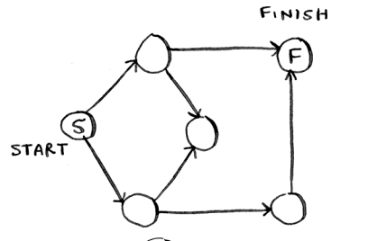
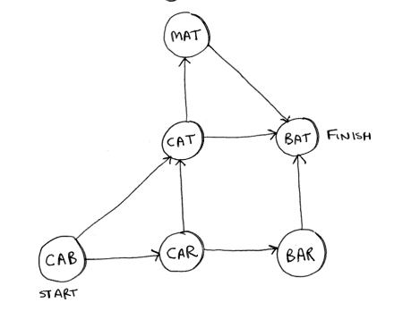
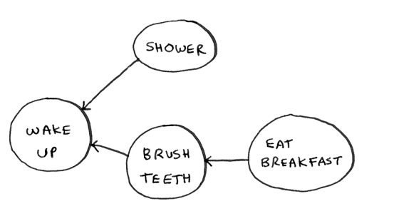
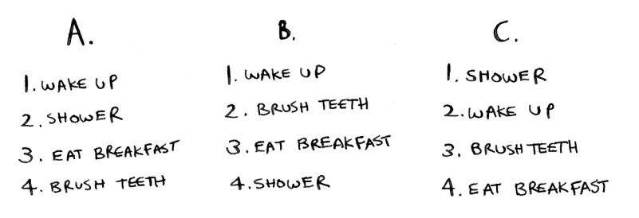
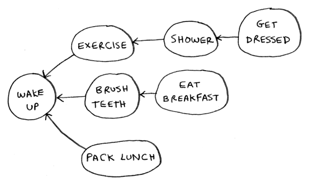
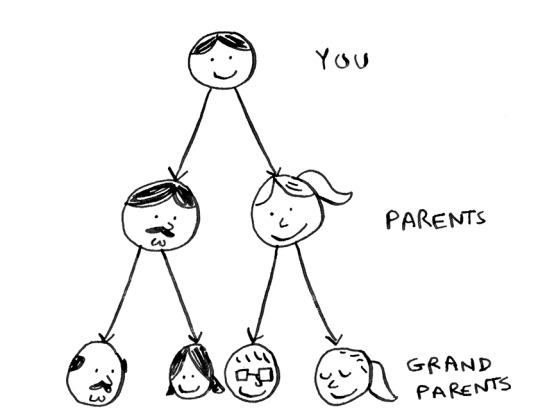
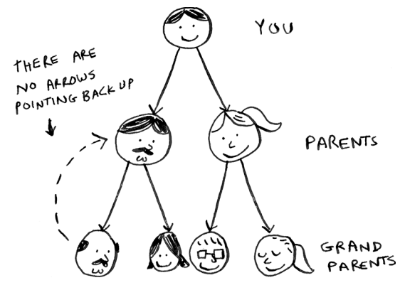
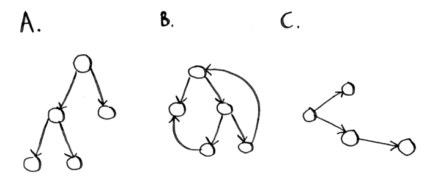

# EXERCISES
Run the breadth-first search algorithm on each of these graphs to find
the solution.

## 6.1
Find the length of the shortest path from start to finish.



My answer:
```
S -> Up -> right -> F
A length of 2 steps
```
Book answer:
```
Answer: The shortest path has a length of 2
```

## 6.2
Find the length of the shortest path from “cab” to “bat.



My answer:
```
Cab -> Cat -> Bat
A length of 2 steps
```
Book answer:
```
Answer: The shortest path has a length of 2.
```


Here’s a small graph of my morning routine.



It tells you that I can’t eat breakfast until I’ve brushed my teeth. So “eat breakfast” depends on “brush teeth.

On the other hand, showering doesn’t depend on brushing my teeth because I can shower before I brush my teeth. From this graph, you can make a list of the order in which I need to do my morning routine:

1. Wake up.
2. Shower.
3. Brush teeth.
4. Eat breakfast.

Note that “shower” can be moved around, so this list is also valid:

1. Wake up.
2. Brush teeth.
3. Shower.
4. Eat breakfast.

## 6.3
For these three lists, mark whether each one is valid or invalid



My answer:
```
Valid: B
Invalid: A & C
```
Book answer:
```
Answers: A—Invalid; B—Valid; C—Invalid.
```

## 6.4
Here’s a larger graph. Make a valid list for this graph.



You could say that this list is sorted, in a way. If task A depends on task B, task A shows up later in the list. This is called a topological sort, and it’s a way to make an ordered list out of a graph. Suppose you’re planning a wedding and have a large graph full of tasks to do, and you’re not sure where to start. You could topologically sort the graph and get a list of tasks to do in order.
Suppose you have a family tree.



This is a graph, because you have nodes (the people) and edges. The edges point to the nodes’ parents. But all the edges go down—it wouldn’t make sense for a family tree to have an edge pointing back up!
That would be meaningless—your dad can’t be your grandfather’s dad!



This is called a tree. A tree is a special type of graph where no edges ever point back.

My answer:
```
1—Wake up
2—Exercise
3—Shower
4—Brush teeth
5—Get dressed
6—Pack lunch
7—Eat breakfast.
```

Book answer:

```
Answer: 1—Wake up; 2—Exercise; 3—Shower; 4—Brush teeth;
5—Get dressed; 6—Pack lunch; 7—Eat breakfast.
```

## 6.5
Which of the following graphs are also trees?



My answer:
```
A & C
```
Book answer:

```
Answers: A—Tree; B—Not a tree; C—Tree. The last example is just
a sideways tree. Trees are a subset of graphs. So a tree is always a graph, but a graph may or may not be a tree.
```