# What is a graph?

A graph models a set of connections. Each graph is made up of nodes and edges.
Graphs are made up of nodes and edges. A node can be directly connected to many other nodes. Those nodes are called in-neighbors or out-neighbors.

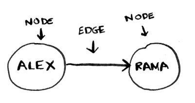

Since Alex is pointing to Rama, Alex is Rama’s in-neighbor, and Rama
is Alex’s out-neighbor. This terminology can be confusing, so here’s a
diagram to help.

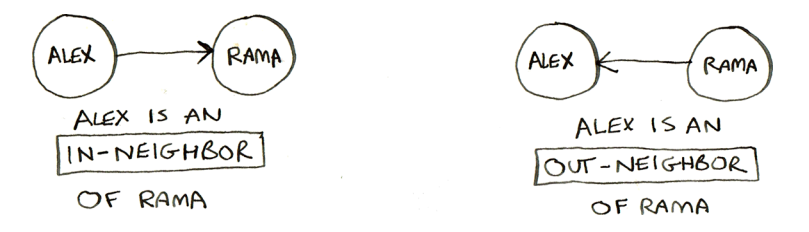

> Graphs are a way to model how different things are connected to one
another. 

# Breadth-first search

Breadthfirst search is a different kind of search algorithm: one that runs on
graphs. It can help answer two types of questions:

- Question type 1: Is there a path from node A to node B?
- Question type 2: What is the shortest path from node A to node B?

Suppose you’re the proud owner of a mango farm. You’re looking for a
mango seller who can sell your mangoes. Are you connected to a mango
seller on Facebook? Well, you can search through your friends.

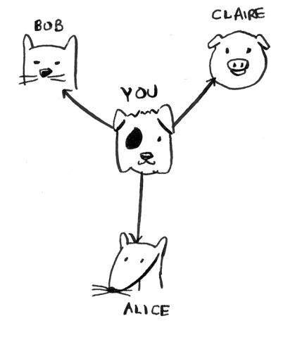

This search is pretty straightforward.
First, make a list of friends to search.

Now, go to each person in the list and
check whether that person sells mangoes

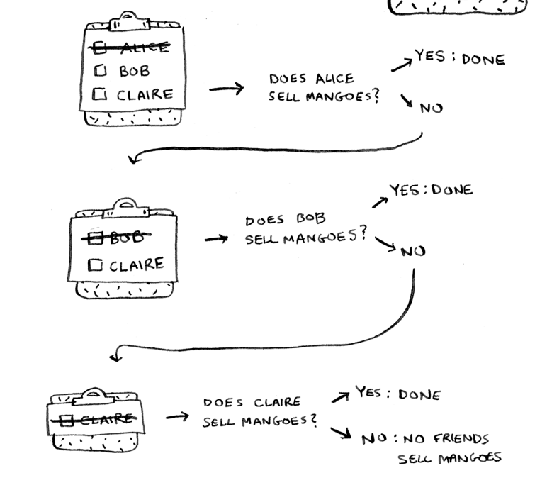

Suppose none of your friends are mango sellers. Now you have to search
through your friends’ friends.

Each time you search for someone from the list, add all of their friends
to the list.

This way, you not only search your friends, but you search their friends,
too. Remember, the goal is to find one mango seller in your network.
So if Alice isn’t a mango seller, you add her friends to the list, too. That
means you’ll eventually search her friends—and then their friends, and
so on. With this algorithm, you’ll search your entire network until you
come across a mango seller. This algorithm is **breadth-first search**.

## Finding the shortest path
As a recap, these are the two questions that breadth-first search can
answer for you:

- Question type 1: Is there a path from node A to node B? (Is there a
mango seller in your network?)
- Question type 2: What is the shortest path from node A to node B?
(Who is the closest mango seller?)

You saw how to answer question 1; now let’s try to answer question 2. Can
you find the closest mango seller? For example, your friends are firstdegree connections, and their friends are second-degree connections.

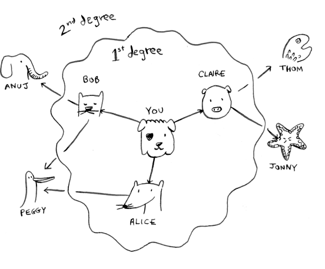

You’d prefer a first-degree connection to a second-degree connection, a
second-degree connection to a third-degree connection, and so on. So
you shouldn’t search any second-degree connections before you make
sure you don’t have a first-degree connection who is a mango seller.

You’d prefer a first-degree connection to a second-degree connection, a
second-degree connection to a third-degree connection, and so on. So
you shouldn’t search any second-degree connections before you make
sure you don’t have a first-degree connection who is a mango seller.

Another way to see this is that first-degree connections are added to the search list before second-degree connections.

You just go down the list and check people to see whether each one is a mango seller. The firstdegree connections will be searched before the second-degree connections, so you’ll find the mango seller closest to you. Breadth-first search not only finds a path from A to B; it also finds the shortest path.

What happens if you search Anuj before Claire, and they’re both mango sellers? Well, Anuj is a second-degree contact, and Claire is a first-degree contact. You end up with a mango seller who isn’t the closest to you in your network. So you need to search people in the order that they’re added. There’s a data structure for this: it’s called a queue.

## Queues

A queue works exactly like it does in real life. Queues are similar to
stacks. You can’t access random elements in the queue. Instead, there are only two
operations, enqueue and dequeue.

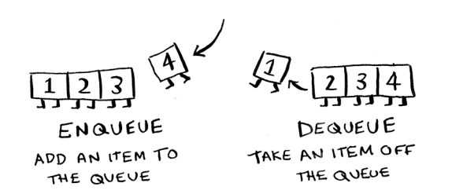

If you enqueue two items to the list, the first item you added will be dequeued before the second item. You can use this for your search list!
People who are added to the list first will be dequeued and searched first.

The queue is called a FIFO data structure: first in, first out. In contrast, a
stack is a LIFO data structure: last in, first out.

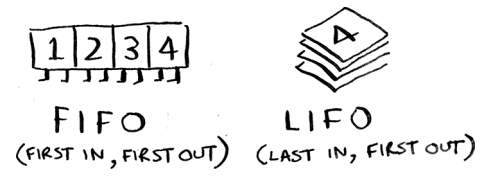

## Implementing the graph

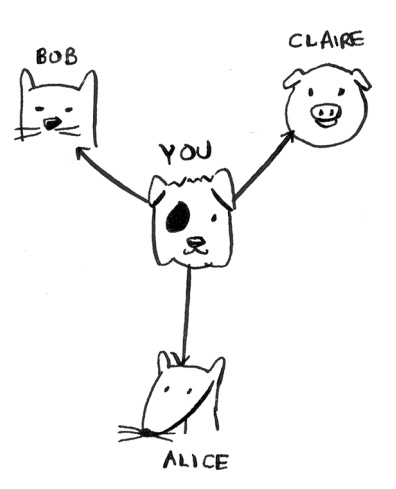

First, you need to implement the graph in code.
A graph consists of several nodes.

And each node is connected to other nodes.

Luckily, you know a data structure that lets you express relationships: a hash table!
Remember, a hash table allows you to map a key to a value. In this case, you want to map a node to all of its out-neighbors.

Here’s how you’d write it in Python:

```python
graph = {}
graph["you"] = ["alice", "bob", "claire"]
```

A graph is just a bunch of nodes and edges, so this is all you need to have a graph in Python. What about a bigger graph like this one?

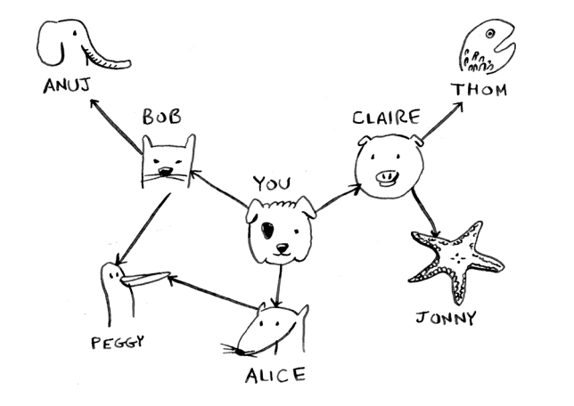

Here it is as Python code:

```python
graph = {}
graph["you"] = ["alice", "bob", "claire"]
graph["bob"] = ["anuj", "peggy"]
graph["alice"] = ["peggy"]
graph["claire"] = ["thom", "jonny"]
graph["anuj"] = []
graph["peggy"] = []
graph["thom"] = []
graph["jonny"] = []
```

Pop quiz: Does it matter what order you add the key/value pairs in? 
> Does it matter if you write
```python
graph["claire"] = ["thom", "jonny"]
graph["anuj"] = []
```
> instead of
```python
graph["anuj"] = []
graph["claire"] = ["thom", "jonny"]
```

> Answer: It doesn’t matter. Hash tables have no ordering, so it doesn’t matter what order you add key/value pairs in.

Anuj, Peggy, Thom, and Jonny don’t have any out-neighbors. They have `in-neighbors` since they have arrows pointing to them, but no arrows point from them to someone else. This is called a **directed graph**: the relationship is only one way. An **undirected graph** doesn’t have any arrows. For example, both of these graphs are equal.

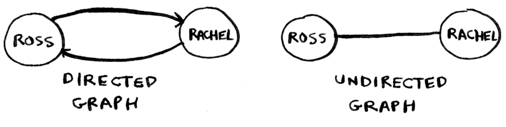

If you have an undirected graph, you can forget the terms `in-neighbor` and `out-neighbor` and use the simpler term `neighbor`.

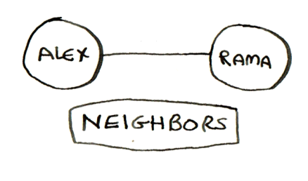

## Implementing the algorithm

To recap, here’s how the implementation will work.

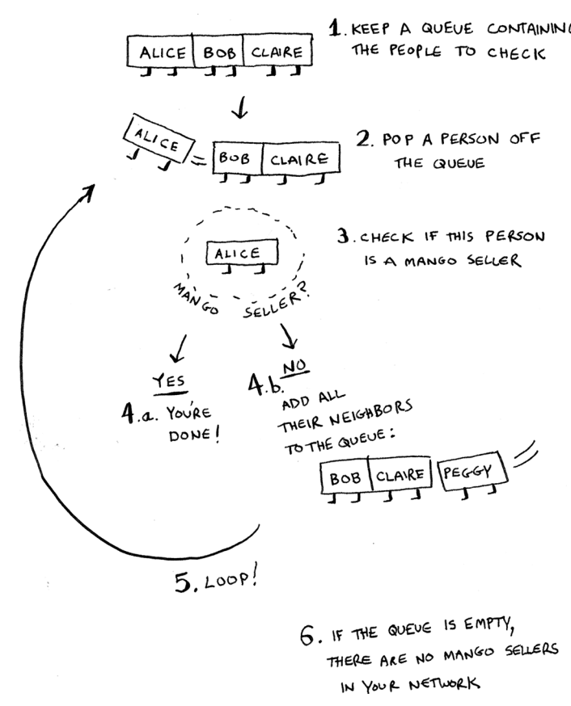

> Note:
When updating queues, I
use the terms enqueue and
dequeue. But sometimes
you’ll see people using different terms. Python uses
append and popleft instead
of enqueue and dequeue.

Make a queue to start. In Python, you use the double-ended queue (deque) function for this:

```python
from collections import deque
search_queue = deque() # Creates a new queue
search_queue += graph["you"] # Adds all of your out-neighbors to the search queue
```

Remember, `graph["you"]` will give you a list of all your outneighbors, like `["alice", "bob", "claire"]`. Those all get added to the search queue.

Let’s see the rest:

```python
while search_queue: # <- While the queue isn’t empty . . .
    person = search_queue.popleft() # <- . . . grabs the first person off the queue.
    if person_is_seller(person): # <- Checks whether the person is a mango seller
        print(person + " is a mango seller!") # <- Yes, they’re a mango seller
        return True
    else:
        search_queue += graph[person] # <- No, they aren’t. Add all of this person’s friends to the search queue
    return False # <- If you reached here, no one in the queue is a mango seller.
```

One final thing: you still need a person_is_seller function to tell you when someone is a mango seller. Here’s one:

```python
def person_is_seller(name):
    return name[-1] == 'm'
```

This function checks whether the person’s name ends with the letter m. If it does, they’re a mango seller. Kind of a silly way to do it, but it’ll do for this example. Now let’s see the breadth-first search in action.

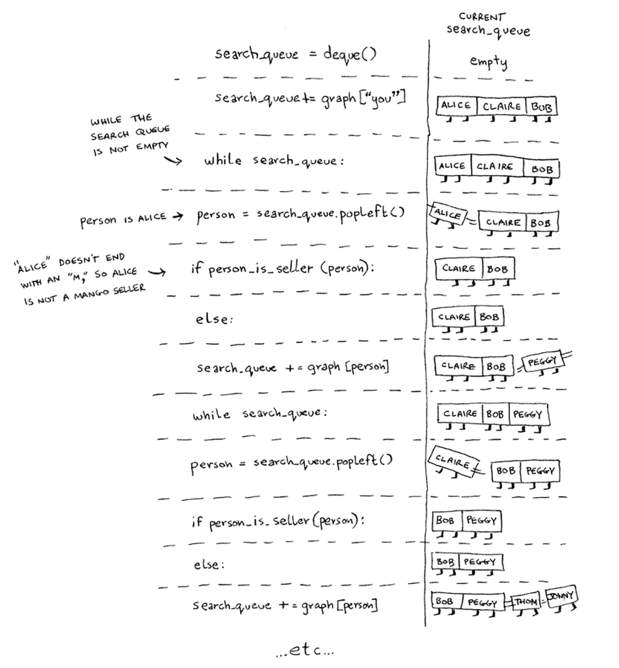

The algorithm will keep going until either a mango seller is
found or the queue becomes empty, in which case there is no mango seller.

So once you search a person, you should mark that person as searched and not search them again.

Before checking a person, it’s important to make sure they haven’t been checked already. To do that, you’ll keep a set of people you’ve already checked.

Here’s the final code for breadth-first search, taking that into account:

```python
def search(name):
    search_queue = deque()
    search_queue += graph[name]
    searched = set() # <- This set is how you keep track of which people you’ve searched before.
    while search_queue:
        person = search_queue.popleft()
        if not person in searched: # <- Only search this person if you haven’t already searched them.
            if person_is_seller(person):
                print(person + " is a mango seller!")
                return True
            else:
                search_queue += graph[person]
                searched.add(person) # <- Marks this person as searched
    return False
search("you")
```

## Running time

If you search your entire network for a mango seller, that means you’ll follow each edge (remember, an edge is the arrow or connection from one person to another). So the running time is at least O(number of edges).

You also keep a queue of every person to search. Adding one person to the queue takes constant time: O(1). Doing this for every person will take O(number of people) total. Breadth-first search takes O(number of people + number of edges), and it’s more commonly written as O(V+E) (V for number of vertices; E for number of edges).

# Recap

- Breadth-first search tells you if there’s a path from A to B.
- If there’s a path, breadth-first search will find the shortest path.
- If you have a problem like “find the shortest X,” try modeling your problem as a graph and use breadth-first search to solve it.
- A directed graph has arrows, and the relationship follows the direction of the arrow (rama → adit means “rama owes adit money”).
- Undirected graphs don’t have arrows, and the relationship goes both ways (ross — rachel means “ross dated rachel and rachel dated ross”).
- Queues are FIFO (first in, first out).
- Stacks are LIFO (last in, first out).
- You need to check people in the order they were added to the search list, so the search list needs to be a queue. Otherwise, you won’t get the shortest path.
- Once you check someone, make sure you don’t check them again. Otherwise, you might end up in an infinite loop.
