Trees are a type of graph. Rooted trees have one node that leads to all the
other nodes.

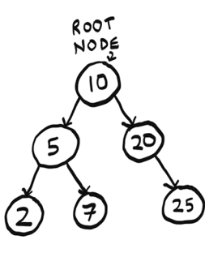

Nodes can have children, and child nodes can have a parent.
In a tree, nodes have at most one parent.
The only node with no parents is the root.
Nodes with no children are called **leaf** nodes.

# File Directories

A file directory is a tree that all of us interact with every day. Suppose I have this file directory.

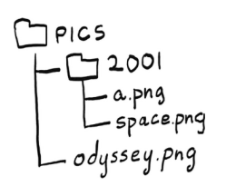

I want to print the name of every file in the pics directory, including all its subdirectories.

Since this file directory is a tree, we can run a graph algorithm on it. 

Breadth-first search is a traversal algorithm. That means it is an algorithm that visits every node in a
tree—that is, it traverses or walks the tree. That’s exactly what we need!
We will use breadth-first search to list all the files in a directory. The algorithm will also go into subdirectories, find files in
there, and print out their names.

The code follows. It is very similar to the mango seller code from chapter 6:
```python
from os import listdir
from os.path import isfile, join
from collections import deque

def printnames(start_dir):
    search_queue = deque() # <- We use a queue to keep track of folders to search.
    search_queue.append(start_dir)
    while search_queue: # <- While the queue is not empty, pop off a folder to look through.
        dir = search_queue.popleft()
        for file in sorted(listdir(dir)): # Loop through every file and folder in this folder
            fullpath = join(dir, file)
            if isfile(fullpath):
                print(file) # <- If it is a file, print out the name.
            else:
                search_queue.append(fullpath) # <- If it is a folder, add it to the queue of folders to search.
printnames("pics")
```

Trees don’t have cycles, and each node only has one parent. This property of trees has made our code simpler. That’s an important takeaway from this chapter: trees don’t have cycles.

> A note on symbolic links
You may know what symbolic links are. If you don’t, symbolic links are a
way to introduce a cycle in a file directory. I could make a symbolic link on
macOS or Linux with
```
ln -s pics/ pics/2001/pics
```
or, on Windows, with
```
mklink /d pics/ pics/2001/pics
```
If I did that, the tree would look like the following.

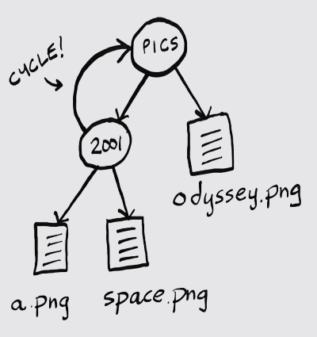

Now our file directory isn’t a tree anymore! To keep things simple, for this
example, we are going to ignore symbolic links. If we did have a symbolic link,
Python is smart enough to avoid an infinite loop. Here is the error it throws:

```
OSError: [Errno 62] Too many levels of symbolic links: 'pics/2001/pics'
```

# Depth-first search

Let’s traverse our file directory again, doing it recursively this time:

```python
from os import listdir
from os.path import isfile, join
def printnames(dir):
    for file in sorted(listdir(dir)): # <- Loop through every file and folder in the current folder
        fullpath = join(dir, file)
        if isfile(fullpath):
            print(file) # <- If it is a file, print out the name.
        else:
            printnames(fullpath) # <- If it is a folder, call this function recursively on it to look for files and folders.
printnames("pics")
```
Notice that now we are not using a queue. Instead, when we
come across a folder, we immediately look inside for more
files and folders. Now we have two ways of listing the file names.
But here’s the surprising part: the solutions will print the file
names in different orders!

One prints the names out like this:

```
a.png
space.png
odyssey.png
```
The other prints this:
```
odyssey.png
a.png
space.png
```

The first solution uses breadth-first search. When it finds a folder, that
folder is added to the queue to be checked later. So the algorithm goes
to the 2001 folder, does not go into it but adds it to the queue to be
looked at later, prints all the file names in the pics/ folder, and then goes
back to the 2001/ folder and prints the file names in there.

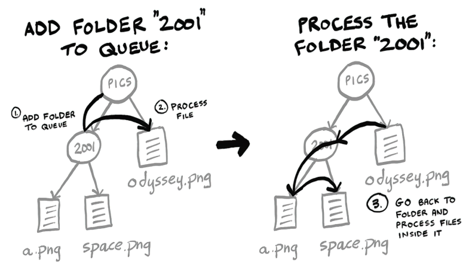

The second solution uses an algorithm called depth-first search. Depthfirst search is also a graph and tree traversal algorithm. When it finds a folder, it looks inside immediately instead of adding it to a queue.

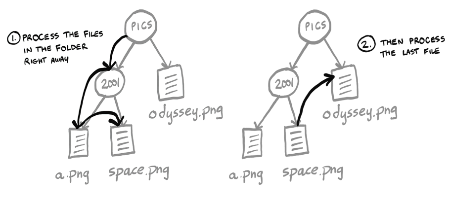

The second solution is the one that prints out
```
a.png
space.png
odyssey.png
```
Breadth-first search and depth-first search are closely related, and
often where one is mentioned, the other will be also. Both algorithms
printed out all the file names, so they both work for this example. But
there is a big difference. Depth-first search cannot be used for finding
the shortest path!

## A better definition of trees

A tree is a connected, acyclic graph.

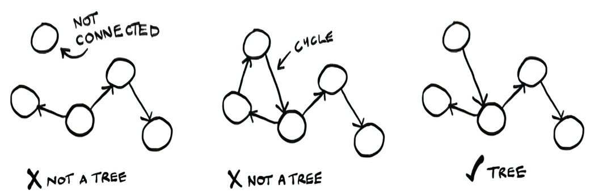

So the most important thing to remember is trees cannot have cycles.

# Binary trees

Computer science is full of different types of trees. Binary trees are a very common type of tree.

A binary tree is a special type of tree where nodes can have at most two children (hence the name binary, meaning two). These are traditionally called left child and right child.

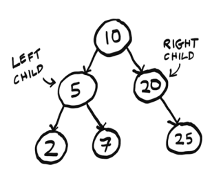

An ancestry tree is an example of a binary tree since everyone has two biological parents. In that example, there’s a clear connection between nodes—they are all family. However, the data can be totally arbitrary.

> The important thing is you never have more than two children.
Sometimes people refer to the left subtree or right subtree.

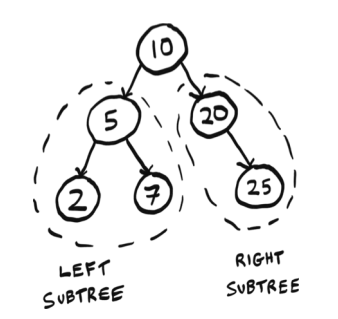

# Huffman coding

Huffman coding is a neat example of using binary trees. It’s also the foundation for text compression algorithms.

First, a little background. To know how compression works, we need to know how much space a text file takes. Suppose we have a text file with just one word: tilt. How much space does that use? You can use the stat command (available on Unix). First, save the word in a file called test.txt. Then, using stat,

```shell
$ cat test.txt
tilt
$ stat -f%z test.txt
4
```

so that file takes up 4 bytes: 1 byte per character.

## Character encoding

As this example will show you, there are many different ways to encode characters. That is, the letter a could be written in binary in many different ways.

It started with ASCII. In the 1960s, ASCII was created. ASCII is a 7-bit encoding. Unfortunately, ASCII did not include a lot of characters. ASCII does not include any characters with umlauts (ü or ö, for example) or common currencies like the British pound or Japanese yen.

So ISO-8859-1 was created. ISO-8859-1 is an 8-bit encoding, so it doubles the number of characters that ASCII provided. We went from 128 characters to 256 characters. But this was still not enough, and countries began making their own encodings. For example, Japan has several encodings for Japanese since ISO-8859-1 and ASCII were focused on European languages. The whole situation was a mess until Unicode was introduced.

Unicode is an encoding standard. It aims to provide characters for any language. Unicode has 149,186 characters as of version 15—quite a jump from 256! More than 1,000 of these are emojis. Unicode is the standard, but you need to use an encoding that follows the standard. The most popular encoding today is UTF-8. UTF-8 is variablelength character encoding, which means characters can be anywhere from 1 to 4 bytes (8–32 bits).

You don’t need to worry too much about this. I’ve kept the example simple intentionally by using ISO-8859-1, which is 8 bits—a nice consistent quantity of bits to work with.

Just remember these takeaways:

- Compression algorithms try to reduce the number of bits needed to
store each character.
- If you need to pick an encoding for a project, UTF-8 is a good default
choice.


Let’s decode some binary to ISO-8859-1 together:

```
011100100110000101100100
```

First, we know that each letter is 8 bits, so I am going to divide this into chunks of 8 bits to make it easier to read:

```
01110010 01100001 01100100
```

Looking them up in an ISO-8859-1 table, I see they spell out `rad: 01110010` is `r`, and so on.

You can view the binary information by using `xxd`. This utility is available on Unix. Here is how tilt looks in binary:

```shell
$ xxd -b test.txt
00000000: 01110100 01101001 01101100 01110100
tilt
```

Here is where the compression comes in. For the word tilt, we don’t need 256 possible letters; we just need three. So we don’t need 8 bits; we only need 2. We could come up with our own 2-bit code just for these three letters:

```
t = 00
i = 01
l = 10
```
Here is how we could write tilt using our new code: 00011000. I can make this easier to read by adding spaces again: 00 01 10 00. If you compare it to the mapping, you’ll see this spells out tilt.

This is what Huffman coding does: it looks at the characters being used
and tries to use less than 8 bits. That is how it compresses the data.
Huffman coding generates a tree.

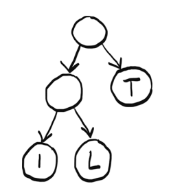

You can use this tree to find the code for each letter. Starting at the root node, find a path down to the letter L. Whenever you choose a left branch, append a 0 to your code. When you choose a right branch, append 1. When you get to a letter, stop progressing down the tree. So the code for the letter L is 01. Here are the three codes given by the tree:

```
i = 00
l = 01
t = 1
```

> Notice that the letter T has a code of just one digit. Unlike ISO-8859-1, in Huffman coding, the codes don’t all have to be the same length. This is
important. Let’s see another example to understand why.

Now we want to compress the phrase `“paranoid android.”` Here is the tree generated by the Huffman coding algorithm.

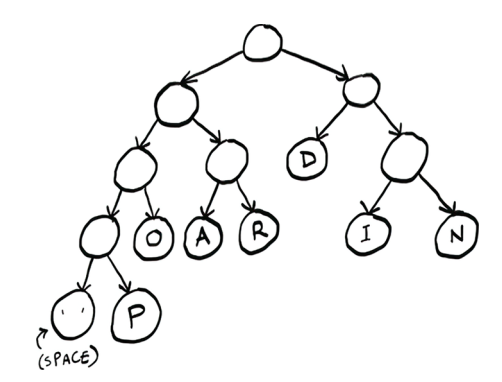

Check yourself: What is the code for the letter P? Try it yourself before reading on. It is 0001. What about the letter D? It is 10. In this case, there are actually three different possible lengths! Suppose we try to decode some binary data:
01101010. We see the problem right away: we can’t chunk this up the way we
did with ISO-8859-1! While all ISO-8859-1 codes were eight digits, here the code could be two, three, or four digits. *Since the code length varies, we can’t use
chunking anymore.*

Instead, we need to look at one digit at a time, as if we are looking at
a tape.

Here’s how to do it: first number is 0, so go left (I’m only showing part of the tree here). Then we get a 1, so we go right. Then we get another 1, so we go right again.

This is the binary data we have left: 01010.
We can start over at the root node and find the other letters. It was rad. This is a big difference between Huffman coding and ISO-8859-1. The codes can vary, so the decoding needs to be done differently.

It is more work to do it this way instead of chunking. But there is one big benefit. Notice that the letters that show up more often have shorter codes. D appears three times, so its code is just two digits versus I, which appears twice, and P, which appears only once. Instead of assigning 4 bits to everything, we can compress frequently used letters even more. You can see how, in a longer piece of text, this would be a big savings!

Now that we understand at a high level how Huffman coding works, let’s see what properties of trees Huffman is taking advantage of here.

First, could there be overlap between codes? Take this code for example:
```
a = 0
b = 1
c = 00
```

Now if you see the binary 001, is that AAB or CB? c and a share part of their code, so it’s unclear. Here is what the tree for this code would look like.

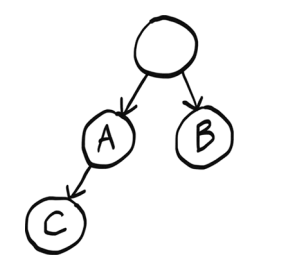

We pass A on the way to C, which causes the problem.

That’s not a problem with Huffman coding because letters only show up at leaf nodes. And there’s a unique path from the root to each leaf node—that’s one of the properties of trees. So we can guarantee overlap is not a problem.

This also guarantees there is only one code for each letter. Having multiple paths to each letter would mean there are multiple codes assigned to each letter, which would be unnecessary.

When we read the code one digit at a time, we are assuming we will eventually end up at a letter. If this was a graph with a cycle, we couldn’t make that assumption. We could get stuck in the cycle and end up in an infinite loop.

But since this is a tree, we know there are no cycles, so we are guaranteed to end up at some letter.

We are using a rooted tree. Rooted trees have a root node, which is important because we need to know where to start! Graphs do not necessarily have a root node.

Finally, the type of tree used here is called a **binary tree**. **Binary trees** can have at most two children—the left child and the right child. This makes sense because binary only has two digits. If there was a third child, it would be unclear what digit it is supposed to represent.

# Recap

- Trees are a type of graph, but trees don’t have cycles.
- Depth-first search is another graph traversal algorithm. It can’t be used to find shortest paths.
- A binary tree is a special type of tree where nodes can have, at most, two children.
- There are many different types of character encodings. Unicode is
the international standard, and UTF-8 is the most common Unicode
encoding.