# Improving insertion speed with trees

We know that insertions are faster in linked lists. So we want some kind of data structure that combines these ideas.

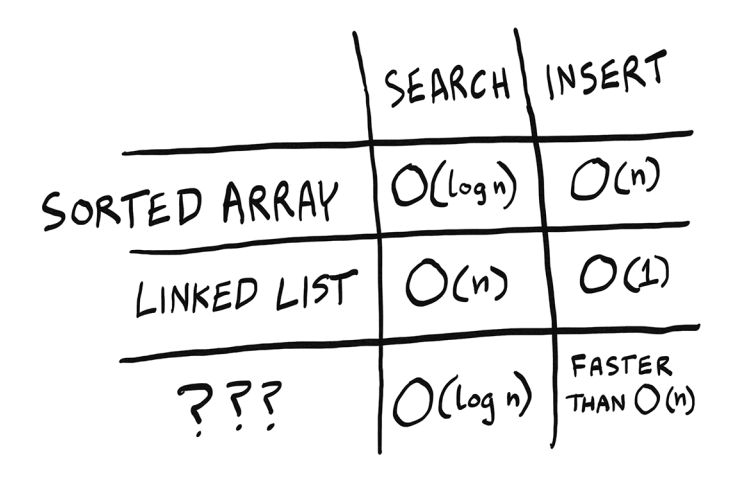

And that structure is a tree! There are dozens of different types of trees to choose from, so I specifically mean a balanced binary search tree (BST).

BSTs are a type of binary tree. Here is an example of a BST.

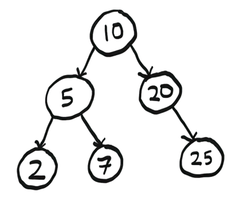

Just like a binary tree, each node has up to two children: the left child and the right child. But it has a special property that makes it a BST: the value of the left child is always smaller than the node, and the value of the right child is always greater. So for node 10, its left child has a smaller value (5), and its right child has a bigger value (20).

Not only that, all the numbers in the left child subtree are smaller than the node!
This special property means searches will be very fast.

# Shorter trees are faster

Let’s look at two trees. They both have seven nodes, but the
performance is very different.

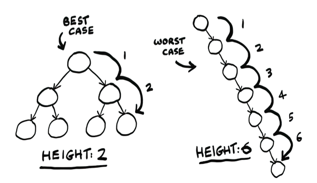

The height of the best-case tree is 2. This means you can get to any node from the root node in, at most, two steps. The height of the worst-case tree is 6. This means you can get to any node from the root node in, at most, six steps. Let’s compare this to the performance of binary search versus simple search. Just to remind you, here’s the performance of binary search versus simple search:

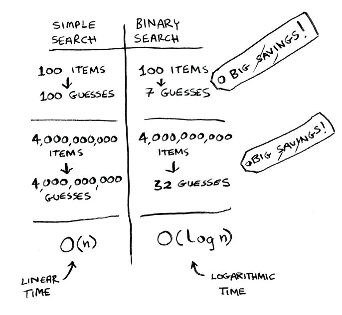

Remember our number guessing game? To guess a number out of 100 numbers, it would take 7 guesses with binary search, but 100 guesses with simple search. Well, we’re in a similar situation with trees.

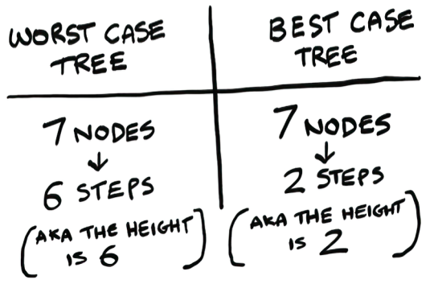

The worst-case tree is taller, and it has worse performance. In the worst-case tree, the nodes are all in a line. This tree has height **O(n)**, so searches will take **O(n)** time. You can think of it this way: this tree is really just a __linked list__ since one node points to another, and so on, in a line. And searching through a linked list takes **O(n)** time. The best-case tree has height **O(log n)**, and searching this tree will take **O(log n)** time.

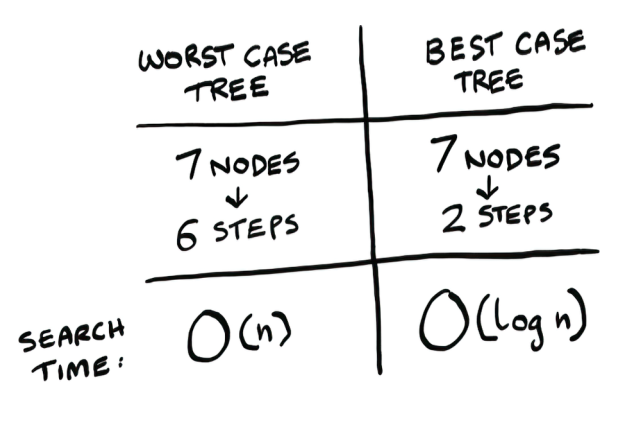

*If we can guarantee the height of our tree will be O(log n), then searching the tree will be O(log n), just like we wanted.*

But how can we guarantee the height will be O(log n)? Here’s an example where we build a tree that ends up being a worst-case tree (something we want to avoid). 

We will start with one node. Let’s add another one. So far, so good. Let’s add a few more. We keep having to add these nodes to the right since they are all bigger than the other nodes.

```
10->20->30->40->50
```

Yikes, this tree is a worst-case tree—its height is O(n)! Shorter trees are faster. The shortest a BST can be is O(log n). To make a BST shorter, we need to balance it. So lets look at a balanced BST next.

# AVL trees: A type of balanced tree

AVL trees are a type of self-balancing BST. This means AVL trees will maintain a height of O(log n). Whenever the tree is out of balance—that is, the height is not O(log n)—it will correct itself. For the last example, the tree may balance itself to look like this.

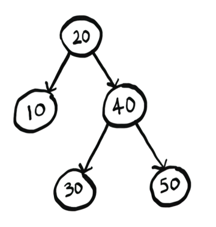

An AVL tree will give us that O(log n) height we want by balancing itself through rotations.

## Rotations

Suppose you have a tree with three nodes. Any one of them could be the root node.

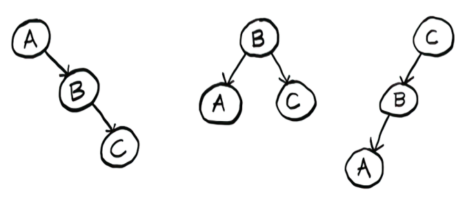

You use rotation to move a set of nodes to end up with a new arrangement.

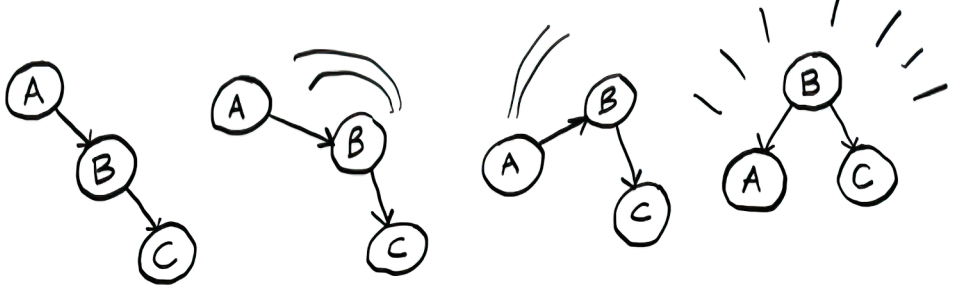

We rotated to the left. We started with an unbalanced tree with A as the root node and ended up with a balanced tree with B as the root node. Rotations are a popular way to balance trees. AVL trees use rotation to balance.

## How does the AVL tree know when it’s time to rotate?

We can see visually that the tree is off balance—one side is longer than the other. But how does the tree know that?

For the tree to know when it’s time to balance itself, it needs to store some extra information. Each node stores one of two pieces of information: its height or something called a balance factor. The balance factor can be −1, 0, or 1.

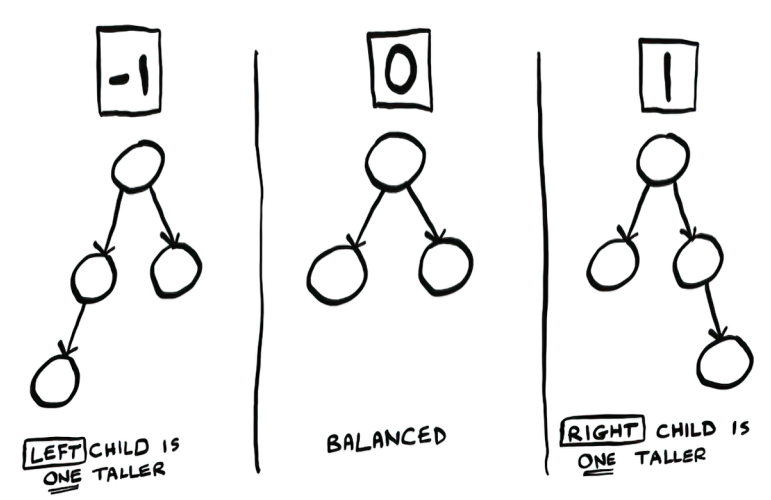

The balance factor tells you which child is taller and by how much. The balance factor lets the tree know when to rebalance. Zero means the tree is balanced. A −1 or 1 is OK, too, because remember, AVL trees don’t have to be perfectly balanced: a difference of one is OK.

But if the balance factor drops below −1 or moves above 1, it’s time to rebalance. To the right are two trees that need rebalancing.

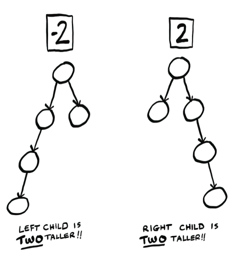

Let’s see an example. Take this tree.

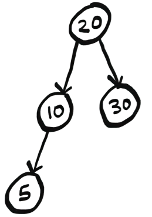

We are going to add `2` to this node to it.

First, let’s write out the height and balance factors for each node. In this image, H is height, and BF is balance factor.

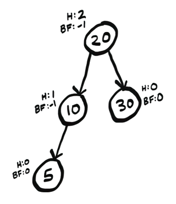

*Remember, I am storing both values to show how they change, but you would only need to store one*. Make sure these numbers make sense to you. Note that all the leaf nodes have a balance factor of 0: they have no child nodes, so there’s nothing to keep in balance.

Now let’s add the new node.

After adding this node, we need to set its height and balance factor. Then we can go up the tree, updating the heights and balance factors for all its ancestors.

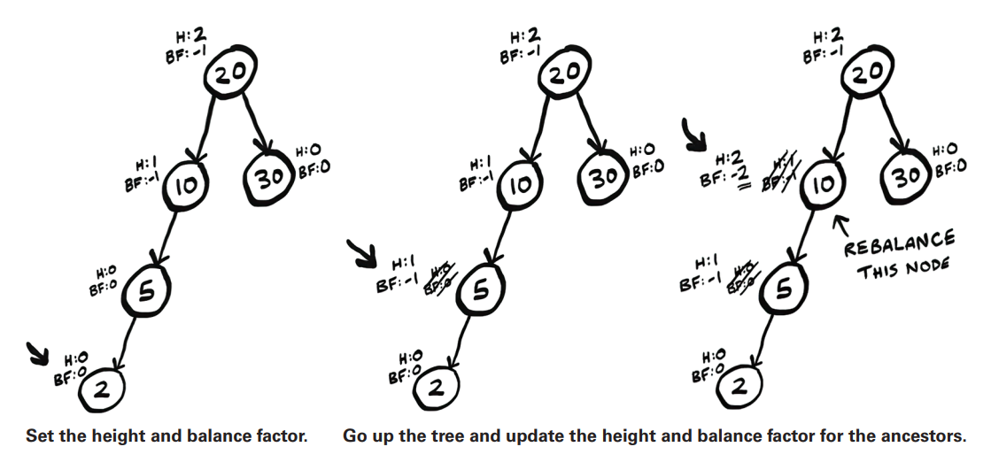

We just set the balance factor to −2, which means it’s time to rotate! I will show the rest of the example next, but this is the main takeaway: after an insert, you update the balance factors for that node’s ancestors. The AVL tree looks at the balance factor to know when it needs to rebalance. Finishing the example, let’s rotate the 10.

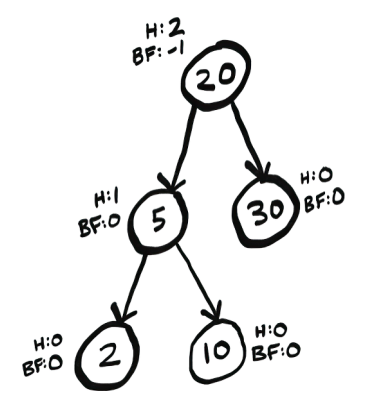

Now that subtree is balanced. Let’s keep moving up the tree.

AVL trees are a good option if you want a balanced BST. Let’s recap our journey:
- Binary trees are a type of tree.
- In binary trees, each node has, at most, two children.
- BSTs are a type of binary tree where all the values in the left subtree are smaller than the node, and all the values in the right are greater than the node.
- BSTs can give great performance if we can guarantee their height will be O(log n).
- AVL trees are self-balancing BSTs, guaranteeing their height will be O(log n).
- AVL trees balance themselves through rotations.

Now we know AVL trees offer O(log n) search performance. What about insertions? Well, insertions are just a matter of searching for a place to insert the node and adding a pointer, just like a linked list.

So insertions are O(log n) as well.

We have found our magic data structure: it’s a balanced BST!

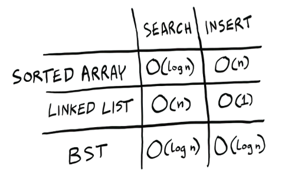

# Splay trees

AVL trees are a good basic balanced BST that guarantees **O(log n)** time for a bunch of operations.

Splay trees are a different take on balanced BSTs. The
cool thing about splay trees is if you have recently looked up an item, the next time you look it up, the lookup will be faster.

When you look up a node in a splay tree, it will make that node the new root, so if you look it up again, the lookup will be instant. In general, the nodes you have looked up recently get clustered to the top and become faster to look up.

The tradeoff is the tree is not guaranteed to be balanced. So some searches might take longer than **O(log n)** time. Some searches may take as long as linear time! Also, while performing the search, you may have to rotate the node up to the root if it is not already the root, and that will take time.

But we are OK with the tradeoff of not having a balanced tree all the time. Because the cool thing is that if you do n searches, the total time is **O(n log n)** guaranteed—that is, **O(log n)** per search. So even though a single search may take longer than **O(log n)** time, overall, they will average out to **O(log n)** time, and the faster search time is our goal.

# B-trees

B-trees are a generalized form of binary tree. They are often used for building databases. Here is a B-tree.

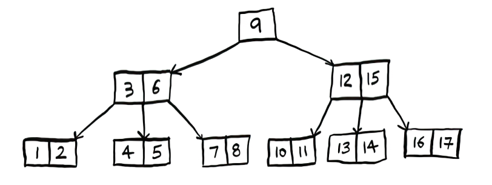

You may notice that some of these nodes have more than two children.

Unlike binary trees, B-trees can have many more children. You’ve probably also noticed that, unlike our previous trees, most nodes have two keys.

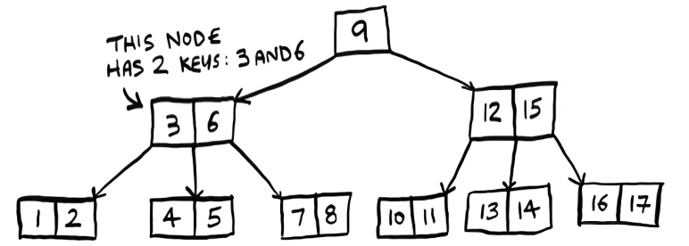

So not only can nodes in B-trees have more than two children, they can have more than one key! This is why I said B-trees are a generalized form of BSTs.

## What is the advantage of B-trees?

B-trees have a very interesting optimization because it’s a physical optimization. Computers are physical objects. So when we are looking things up in a tree, a physical object has to move to retrieve that data. This is called **seek time**. Seek time can be a big factor in how fast or slow your algorithm is.

Think of it like going to the grocery store. You could go shopping for one item at a time. Suppose you decide to buy milk. After coming home, you realize you should get some bread, too, so you go back to the store. After coming home again, you realize you’re out of coffee. So you go back to the store again. What an inefficient way to shop! It would be much better to shop once and buy a bunch of stuff while you are there. In this example, driving to and from the store is the seek time.

The fundamental idea with B-Trees is that once you’ve done the seek, you might as well read a bunch of stuff into memory.

B-trees have bigger nodes: each node can have many more keys and children than a binary tree. So we spend more time reading each node. But we seek less because we read more data in one go. This is what makes B-trees faster.

B-trees are a popular data structure for databases, which is no surprise as databases spend a lot of time retrieving data from disk.

Notice the ordering in a B-tree; it is pretty interesting, too. You start at the lower left.

You’ll snake across the whole tree.

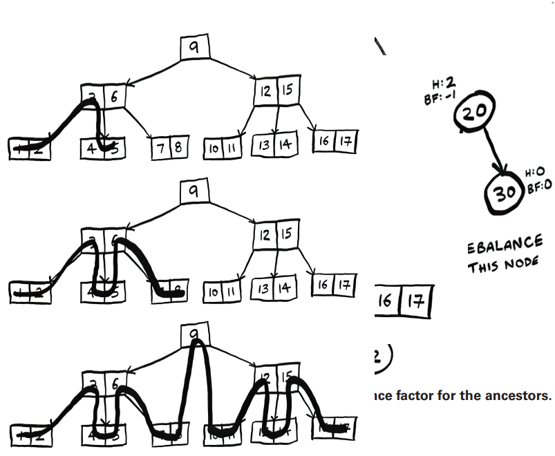

Notice that it is still following the property of the BST, where for each key, the keys to the left are smaller, and the keys to the right are bigger. For example, for key 3, the keys to the left are 1 and 2, and the keys to the right are 4 and 5.

Also notice that the number of children is one greater than the number of keys. So the root node has one key and two children. Each of those children has two keys and three children.

# Recap
- Balanced binary search trees (BSTs) offer the same Big O search performance as arrays with better insertion performance.
- The height of a tree affects its performance.
- AVL trees are a popular type of balanced BST. Like most balanced trees, AVL trees balance themselves through rotation.
- B-trees are generalized BSTs, where each node can have multiple keys and multiple child nodes.
- Seek time is like travel time to a grocery store. B-trees try to minimize seek time by reading more data in one go.