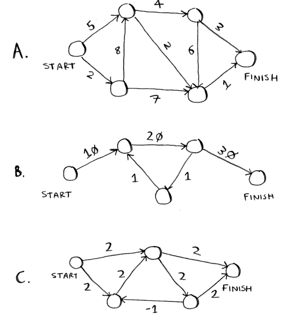

# EXERCISE

## 9.1
In each of these graphs, what is the weight of the shortest path from Start to Finish?



My answer:

```
A: 5->2->1
B: 10->20->30
C: 2->2
```

Book answer:

```
A: A—8;
B—60;
C—4.
```
