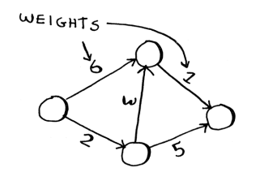
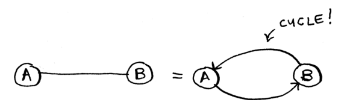
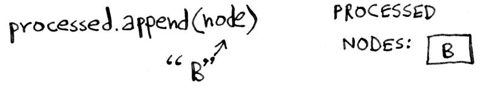

# Working with Dijkstra’s algorithm

Let’s see how it works with this graph.


Each segment has a travel time in minutes. You’ll use Dijkstra’s algorithm to go from Start to Finish in the shortest possible time.

If you ran breadth-first search on this graph, you’d get this shortest path.


But that path takes 7 minutes. Let’s see if you can find a path that takes less time! There are four steps to Dijkstra’s algorithm:

1. Find the “cheapest” node. This is the node you can get to in the least
amount of time.
2. Update the costs of the out-neighbors of this node. I’ll explain what
I mean by this shortly.
3. Repeat until you’ve done this for every node in the graph.
4. Calculate the final path.

**Step 1**: Find the cheapest node. You’re standing at Start, wondering if you should go to node A or node B. How long does it take to get to each node?

It takes 6 minutes to get to node A and 2 minutes to get to node B. The rest of the nodes, you don’t know yet. Because you don’t know how long it takes to get to Finish yet, you put down infinity (you’ll see why soon). Node B is the closest node—it’s 2 minutes away.

**Step 2**: Calculate how long it takes to get to all of node B’s out-neighbors by following an edge from B.


When you find a shorter path for a neighbor of B, update its cost. In this case, you found
- A shorter path to A (down from 6 minutes to 5 minutes)
- A shorter path to Finish (down from infinity to 7 minutes)

**Step 3**: Repeat.

**Step 1 again**: Find the node that takes the least amount of time to get to. You’re done with node B, so node A has the next smallest time estimate.

**Step 2 again**: Update the costs for node A’s out-neighbors.

Woo, it takes 6 minutes to get to Finish now!

You’ve run Dijkstra’s algorithm for every node (you don’t need to run it for the Finish node). At this point, you know

- It takes 2 minutes to get to node B.
- It takes 5 minutes to get to node A.
- It takes 6 minutes to get to Finish.

I’ll just show you what the final path is.


Breadth-first search wouldn’t have found this as the shortest path because it has three segments. And there’s a way to get from Start to Finish in two segments.


Back then, “shortest path” meant the path with the fewest segments. But in Dijkstra’s algorithm, you assign a number or weight to each segment. Then Dijkstra’s algorithm finds the path with the smallest total weight.


To recap, Dijkstra’s algorithm has four steps:

1. Find the cheapest node. This is the node you can get to in the least
amount of time.
2. Check whether there’s a cheaper path to the out-neighbors of this
node. If so, update their costs.
3. Repeat until you’ve done this for every node in the graph.
4. Calculate the final path. (Coming up in the next section!)

## Terminology

When you work with Dijkstra’s algorithm, each edge in the graph has a number associated with it. These are called weights.



A graph with weights is called a *weighted graph*. A graph without weights is called an *unweighted graph*.

To calculate the shortest path in an unweighted graph, use **breadth-first search**. To calculate the shortest path in a weighted graph, use **Dijkstra’s algorithm**. Graphs can also have cycles. A cycle looks like this.


It means you can start at a node, travel around, and end up at the same node. Suppose you’re trying to find the shortest path in this graph that has a cycle.


Would it make sense to follow the cycle? Well, you can use the path that avoids the cycle. Or you can follow the cycle.

You end up at the target node either way, but the cycle adds more weight. You could even follow the cycle twice if you wanted.


But every time you follow the cycle, you’re just adding 8 to the total weight. So following the cycle will never give you the shortest path.

An undirected graph means that both nodes point to each other. That’s a cycle!



With an undirected graph, each edge adds another cycle. Dijkstra’s algorithm only works on graphs with no cycles, where all the edges are nonnegative. Yes, it’s possible for graph edges to have a negative weight! But Dijkstra’s algorithm won’t work—in that case, you’ll need an algorithm called Bellman–Ford.

## Trading for a piano


In this graph, the nodes are all the items Rama can trade for. The weights on the edges are the amount of money he would have to pay to make the trade. So he can trade the poster for the guitar for $30 or trade the LP for the guitar for $15. How is Rama going to figure out the path from the book to the piano where he spends the least dough? Dijkstra’s algorithm to the rescue! Remember, Dijkstra’s algorithm has four steps.

Before you start, you need some setup. Make a table of the cost for each node. The cost of a node is how expensive it is to get to.


You’ll keep updating this table as the algorithm goes on. To calculate the final path, you also need a parent column on this table.


**Step 1**: Find the cheapest node. In this case, the poster is the cheapest trade at $0. Is there a cheaper way to trade for the poster? This is a really important point, so think about it. Can you see a series of trades that will get Rama the poster for less than $0? Read on when you’re ready.
Answer: No. *Because the poster is the cheapest node Rama can get to, there’s no way to make it any cheaper*.

**Step 2**: Figure out how long it takes to get to its out-neighbors (the cost).


You have prices for the bass guitar and the drum set in the table. Their value was set when you went through the poster, so the poster gets set as their parent. That means, to get to the bass guitar, you follow the edge from the poster, and the same for the drums.


**Step 1 again**: The LP is the next cheapest node at $5.
**Step 2 again**: Update the values of all of its out-neighbors.


Hey, you updated the price of both the drums and the guitar! That means it’s cheaper to get to the drums and guitar by following the edge from the LP. So you set the LP as the new parent for both instruments.

The bass guitar is the next cheapest item. Update its out-neighbors.


OK, you finally have a price for the piano by trading the guitar for the piano. So you set the guitar as the parent. Finally, the last node, the drum set.


*So the cheapest set of trades will cost Rama $35.*

So far, you know that the shortest path costs $35, but how do you figure out the path? To start with, look at the parent for piano.


Let’s see how you’d follow the edges. Piano has drums as its parent. And drums has the LP as its parent. And, of course, he’ll trade the book for the LP. By following the parents backward, you now have the complete path.


## Negative-weight edges

Suppose Sarah offers to trade the LP for the poster, and she’ll give Rama an additional $7. It doesn’t cost Rama anything to make this trade; instead, he gets $7 back. How would you show this on the graph?


The edge from the LP to the poster has a negative weight!

Now Rama has two ways to get to the poster.


So it makes sense to do the second trade—Rama gets $2 back that way! Now, if you remember, Rama can trade the poster for the drums. There are two paths he could take.


Well, guess what? If you run Dijkstra’s algorithm on this graph, Rama will take the wrong path. He’ll take the longer path. *You can’t use Dijkstra’s algorithm if you have negative-weight edges*. Negative-weight edges break the algorithm. Let’s see what happens when you run Dijkstra’s algorithm on this. First, make the table of costs.


Next, find the lowest-cost node and update the costs for its outneighbors. In this case, the poster is the lowest-cost node. So, according to Dijkstra’s algorithm, there is no cheaper way to get to the poster than paying $0 (you know that’s wrong!). Anyway, let’s update the costs for
its out-neighbors.


OK, the drums have a cost of $35 now.

Let’s get the next-cheapest node that hasn’t already been processed. Update the costs for its out-neighbors.

You already processed the poster node, but you’re updating the cost for it. This is a big red flag. Once you process a node, it means there’s no cheaper way to get to that node. But you just found a cheaper way to the poster! Drums doesn’t have any out-neighbors, so that’s the end of the algorithm. Here are the final costs.


It costs $35 to get to the drums. You know that there’s a path that costs only $33, but Dijkstra’s algorithm didn’t find it. Dijkstra’s algorithm assumed that because you were processing the poster node, there was no cheaper way to get to that node. That assumption only works if you have no negative-weight edges. So you can’t use negative-weight edges with Dijkstra’s algorithm. If you want to find the shortest path in a graph that has negative-weight edges, there’s an algorithm for that! It’s called the Bellman–Ford algorithm.

# Implementation

Let’s see how to implement Dijkstra’s algorithm in code. Here’s the graph I’ll use for the example.


To code this example, you’ll need three hash tables.


You’ll update the costs and parents hash tables as the algorithm progresses. First, you need to implement the graph. You’ll use a hash table like:

```python
graph = {}
```

In the last chapter, you stored all the out-neighbors of a node in the hash table, like this:

```python
graph["you"] = ["alice", "bob", "claire"]
```

But this time, you need to store the out-neighbors and the cost for getting to that neighbor. For example, Start has two out-neighbors, A and B.


How do you represent the weights of those edges? Why not just use another hash table?

```python
graph["start"] = {}
graph["start"]["a"] = 6
graph["start"]["b"] = 2
```


So graph["start"] is a hash table. You can get all the out-neighbors for Start like this:

```sh
>>> print(list(graph["start"].keys()))
["a", "b"]
```

There’s an edge from Start to A and an edge from Start to B. What if you want to find the weights of those edges?

```python
>>> print(graph["start"]["a"])
6
>>> print(graph["start"]["b"])
2
```

Let’s add the rest of the nodes and their out-neighbors to the graph:

```python
graph["a"] = {}
graph["a"]["fin"] = 1
graph["b"] = {}
graph["b"]["a"] = 3
graph["b"]["fin"] = 5
graph["fin"] = {} # The Finish node doesn’t have any out-neighbors.
```
The full graph hash table looks like this.


Next, you need a hash table to store the current costs for each node.

The cost of a node is how long it takes to get to that node from Start. You know it takes 2 minutes from Start to node B. You know it takes 6 minutes to get to node A (although you may find a path that takes less time). You don’t know how long it takes to get to Finish. If you don’t know the cost yet, you put down infinity. 


Can you represent infinity in Python? Turns out, you can:

```python
infinity = math.inf
```

Here’s the code to make the costs table:

```python
infinity = math.inf
costs = {}
costs["a"] = 6
costs["b"] = 2
costs["fin"] = infinity
```

You also need another hash table for the parents:


Here’s the code to make the hash table for the parents:

```python
parents = {}
parents["a"] = "start"
parents["b"] = "start"
parents["fin"] = None
```

Finally, you need a set to keep track of all the nodes you’ve already processed because you don’t need to process a node more than once:

```python
processed = set()
```

That’s all the setup. Now let’s look at the algorithm.


I’ll show you the code first and then walk through it. Here’s the code:

```python
node = find_lowest_cost_node(costs) # <- Finds the lowest-cost node that you haven’t processed yet
while node is not None: # <- If you’ve processed all the nodes, this while loop is done.
    cost = costs[node]
    neighbors = graph[node]
    for n in neighbors.keys(): # <- Goes through all the out-neighbors of this node
        new_cost = cost + neighbors[n]
        if costs[n] > new_cost: # If it’s cheaper to get to this out-neighbor by going through this node . . .
            costs[n] = new_cost # <- . . . updates the cost for the neighbor
            parents[n] = node # <- This node becomes the new parent for this out-neighbor
    processed.add(node) # <- Marks the node as processed
    node = find_lowest_cost_node(costs) # <- Finds the next node to process and loops
```

I'll show you the code for the find_lowest_cost_node function.

- Find the node with the lowest cost.


- Get the cost and out-neighbors of that node.


- Loop through the out-neighbors.


- Each node has a cost. The cost is how long it takes to get to that node from Start. Here, you’re calculating how long it would take to get to node A if you went Start > node B > node A, instead of Start > node A.


Let’s compare those costs.


- You found a shorter path to node A! Update the cost.


- The new path goes through node B, so set B as the new parent.


- You’re back at the top of the loop. The next out-neighbor in the for loop is the Finish node.


How long does it take to get to Finish if you go through node B?


It takes 7 minutes. The previous cost was infinity minutes, and 7 minutes is less than that.


Set the new cost and the new parent for the Finish node.


- You updated the costs for all the out-neighbors of node B. Mark it as processed.



- Find the next node to process.


- Get the cost and out-neighbors for node A.


- Node A only has one out-neighbor: the Finish node

Currently, it takes 7 minutes to get to the Finish node. How long would it take to get there if you went through node A?


- It’s faster to get to Finish from node A! Let’s update the cost and parent.


Once you’ve processed all the nodes, the algorithm is over.

Finding the lowest-cost node is pretty easy with the find_lowest_cost_node function. Here it is in code:

```python
def find_lowest_cost_node(costs):
    lowest_cost = math.inf
    lowest_cost_node = None
    for node in costs: # <- Goes through each node
        cost = costs[node]
        if cost < lowest_cost and node not in processed: # <- If it’s the lowest cost so far and hasn’t been processed yet
        lowest_cost = cost # <- sets it as the new lowest-cost node
        lowest_cost_node = node
    return lowest_cost_node
```

To find the lowest cost node, we loop through all the nodes each time. There is a more efficient version of this algorithm. It uses a data structure called a priority queue. A priority queue is itself built on top of a different data structure called a heap.

# Recap

- Breadth-first search is used to calculate the shortest path for an unweighted graph.
- Dijkstra’s algorithm is used to calculate the shortest path for a weighted graph.
- Dijkstra’s algorithm works when all the weights are nonnegative.
- If you have negative weights, use the Bellman–Ford algorithm.