This appendix discusses the performance of AVL trees, which were introduced in chapter 8. You will need to read that chapter before reading this.

Remember that AVL trees offer $O(log n)$ search performance. But there is something misleading going on. Here are two trees. Both offer $O(log n)$ search performance, but their heights are different!

<table>
    <tr>
        <td>
            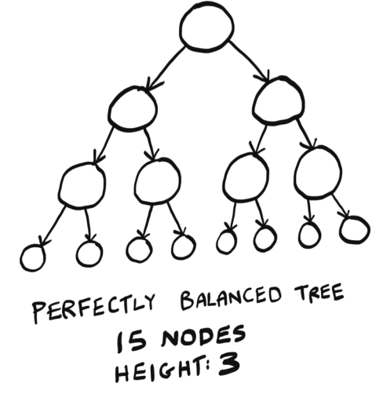
        </td>
        <td>
            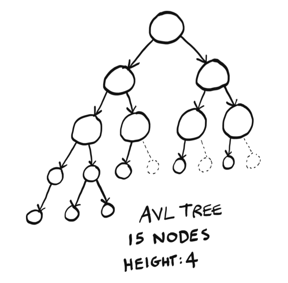
        </td>
    </tr>
</table>

(Dashed nodes show the holes in the tree.)

AVL trees allow a difference of one in heights. That’s why, even though both these trees have 15 nodes, the perfectly balanced tree is height 3, but the AVL tree is height 4. The perfectly balanced tree is what we might picture a balanced tree to look like, where each level is completely filled with nodes before a new level is added. But the AVL tree is also considered “balanced,” even though it has holes—gaps where a node could be.

Remember that in a tree, performance is closely related to height. How can these trees offer the same performance if their heights are different? Well, we never discussed what the base in log n is!

The perfectly balanced tree has performance O(log n), where the “log” is log base 2, just like binary search. We can see that in the picture. Each new level doubles the nodes plus 1. So a perfectly balanced tree of height 1 has 3 nodes, of height 2 has 7 nodes (32 + 1), of height 3 has 15 nodes (72 + 1), etc. You could also think of it as each layer adds a number of nodes equal to a power of 2.

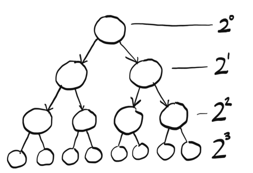

So the perfectly balanced tree has performance O(log n), where the “log” is log base 2.

The AVL tree has some gaps. In an AVL tree, each new layer adds less than double the nodes. It turns out that an AVL offers performance O(log n), but the “log” is log base phi (aka the golden ratio, aka ~1.618).

This is a small but interesting difference—AVL trees offer performance that is not quite as good as perfectly balanced trees since the base is different. But the performance is still very close, since both are O(log n) after all. Just know it’s not exactly the same.

# NP-hard problems

Both the set-covering and traveling salesperson problems have something in common: they are hard to solve. You have to check every possible iteration to find the smallest set cover or the shortest route.

Both of these problems are NP-hard. The terms NP, NP-hard, and NP-complete can cause a lot of confusion. They certainly confused me. I’ll try to explain what all these terms mean, but I need to explain some other concepts first. Here is a roadmap of the things we will learn and how they depend on each other:

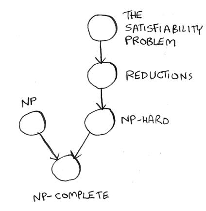

But, first, I need to explain what a decision problem is because all the problems we will look at in the rest of this appendix are decision problems.

## Decision problems

NP-complete problems are always decision problems. A decision problem has a yes-or-no answer. The traveling salesperson problem is not a decision problem. It’s asking you to find the shortest path, which is an optimization problem.

**Note**
> I know I was talking about NP-hard problems in the introduction, and now I’m talking about NP-complete problems. I’ll explain what the difference is soon.

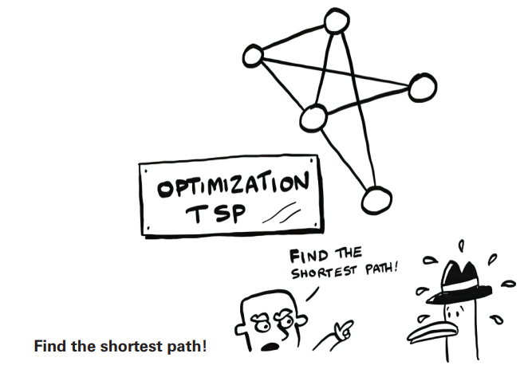

Here’s a decision version of the traveling salesperson problem.

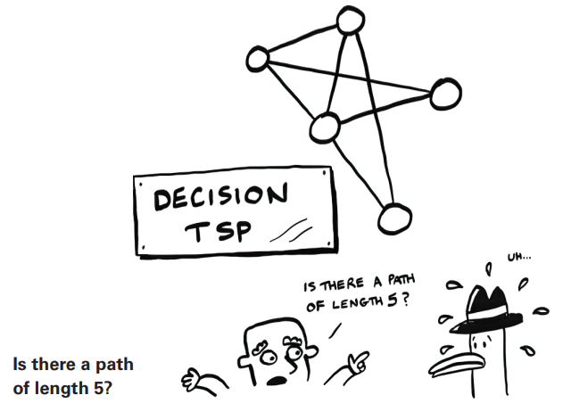

Notice how this question has a yes-or-no answer: is there a path of length 5? I wanted to talk about decision problems up front because all NP-complete problems are decision problems. So all *the problems I discuss in the rest of this will be decision problems*. So when you see “traveling salesperson” mentioned in the rest of this appendix, I mean the *decision* version of the traveling salesperson problem.

Now let’s start learning what NP-complete actually means! The first step is to learn about the satisfiability (SAT) problem.

## The satisfiability problem

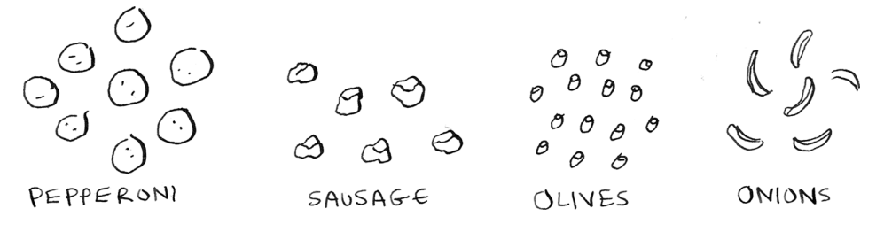

Jerry, George, Elaine, and Kramer are all ordering pizza.

“Ooh, let’s get pepperoni!” says Elaine.

“Pepperoni is good. Sausage is good. We could get pepperoni or sausage,” says Jerry.

“Get me an olive pizza to maintain my complexion,” says Kramer. “Lots of olives. Or, onions.”

“I can do any pizza but no onions,” says George. “I can’t take any more onions, Jerry!”

“Oh boy. OK, let me figure this out. So what toppings do I need again?” says Jerry.

Can you help him out? Here are everyone’s requirements:

- Pepperoni (Elaine)
- Pepperoni or sausage (Jerry)
- Olives or onions (Kramer)
- No onions (George)

See if you can figure out what toppings the pizza should have before moving on.

Did you get it? A pepperoni and olive pizza satisfies all the requirements. This is an example of a SAT problem. In pseudocode, I could write it like this. First, I have four boolean variables:

```
pepperoni = ?
sausage = ?
olives = ?
onions = ?
```

Then I write out a boolean formula: 
```
(pepperoni) and (pepperoni or sausage) and (olives or onions) and (not onions)
```

This formula contains the requirements for each person in the form of boolean logic. The SAT problem asks the question: Can you set these variables to some values so that the statement evaluates to `true`?

The SAT problem is famous because it is the first NP-complete problem, described in 1971 (although I don’t think the authors used Seinfeld as an example). Before this, the concept of an NP-complete problem did not exist. Here is how the SAT problem works. You start with a boolean
formula:

```
if (pepperoni) and (olives or onions):
    print("pizza")
```

Then you ask, is there some way we can assign our variables so that code prints `pizza`?

This example is pretty easy, so we can solve it ourselves. If `pepperoni` and `onions` are `true`, this code will print `pizza`. So the answer would be *yes*.

Here’s one where the answer would be *no*:

```
if (olives or onions) and (not olives) and (not onions):
    print("pizza")
```

There is nothing you can set the variables to so this code will print `pizza`!

The SAT problem always looks for a yes-or-no answer, so it is a decision problem.

SAT is actually a pretty hard problem. Here is a tougher example just to give you an idea:

```
if (pepperoni or not olives) and (onions or not pepperoni) and (not olives or not pepperoni):
    print("pizza")
```

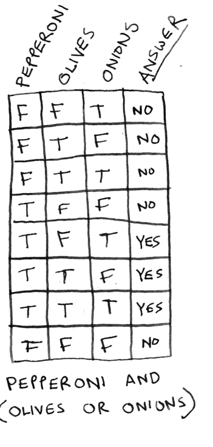

You don’t need to solve this one. I’m just showing it as an example so you can appreciate how hard this problem can get. You can have any number of variables and any number of clauses, and the problems get pretty hard pretty quickly.

With $n$ toppings, there are $2^n$ possible pizzas. If you list them all out and check each one, you get something called a truth table. Here’s the truth table for `pepperoni and (olives or onions)`.

Sometimes you need to list every option, just like the set-covering problem and the traveling salesperson problem! In fact, the SAT problem is just as hard as these two problems. It has a big O run time of $O(2^n)$.

## Hard to solve, quick to verify

We often see problems where finding a solution is much harder than verifying a solution. Suppose I ask you to come up with a sentence that is a palindrome (it reads the same backward and forward) that includes the words cat and car. How long do you think it would take you to come up with that sentence?

Now suppose I tell you that I know a sentence like that. Here it is: *Was it a car or a cat I saw?*

It would take you much less time to verify that claim than to come up with your own sentence. Verifying was quicker than solving!

A SAT problem is as hard to solve as the set-covering problem or the traveling salesperson problem, but unlike those problems, verifying a solution is easy. For example, for this question that we gave earlier: (pepperoni or not olives) and (onions or not pepperoni) and (not olives
or not pepperoni), here’s a solution:

```
pepperoni = False
olives = False
onions = False
```

You can quickly check for yourself that these values will make that boolean formula true. Checking those values was faster than solving it yourself!

The SAT problem is quick to verify, so it is in NP. NP is the class of problems that can be verified in polynomial time. NP problems may or may not be easy to solve, but they are easy to verify. This is different from P.

<table>
    <tr>
        <td>
            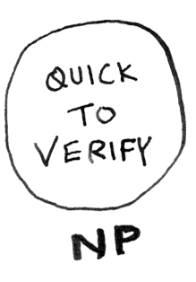
        </td>
        <td>
            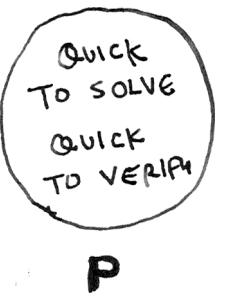
        </td>
    </tr>
</table>

A problem is in P if it can be verified and solved in polynomial time.

Polynomial time means its big O is not bigger than a polynomial.

$ n^3 $

$ n^2+n$

And here are a couple of examples that are not polynomials.

$ n! $

$ 2^n$

P is a subset of NP. So NP contains all the problems in P, plus others.

**P vs. NP**

> You may have heard of the famous P versus NP problem. We just saw that the problems in P are both quick to verify and quick to solve. The problems in NP are quick to verify but may or may not be quick to solve. The P versus NP problem asks whether every problem that is quick to verify is also quick to solve. If that is the case, P wouldn’t be a subset of NP; P would equal NP.

## Reductions

What do you do when you have a hard problem? Change the problem to one you can solve! In real life, when we’re faced with a hard problem, it is extremely common to change the problem.

Here’s one you can try right now. How do you multiply two binary numbers? Try multiplying these two binary numbers:

$ 101 * 110 $

If you’re like me, you didn’t try to figure out how to do the multiplication in binary. You just figured out that 101 is 5 in decimal and 110 is 6, and then you multiplied 5 and 6 instead.

This is called a reduction. You are reducing a problem that you don’t know how to solve to a problem you do know how to solve. This is done all the time in computer science.

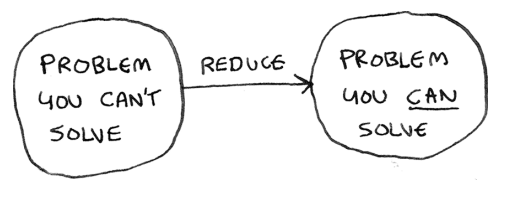

## NP-hard

We have already seen three examples of NP-hard problems:
- The set-covering problem
- The traveling salesperson problem
- The SAT problem

The three previously noted problems are NP-hard. We say a problem is NP-hard *if any problem in NP can be reduced to that problem*. This is the definition of NP-hard.

You can also reduce all NP problems to any NP-hard problem. For example, you can reduce all NP problems to SAT.

One extra requirement is that you need to be able to reduce all these problems in *polynomial time*. That “in polynomial time” is important because you don’t want the reducing part to be the bottleneck. Any NP problem can be reduced to SAT in polynomial time, so it is NP-hard.

Since any problem in NP can be reduced to any NP-hard problem, a polynomial time solution for any one NP-hard problem gives us a polynomial time solution for every problem in NP!

## NP-complete

We’ve seen two definitions:
- Problems in NP are quick to verify and may or may not be quick to solve.
- Problems that are NP-hard are at least as hard as the hardest problems in NP, and any problem in NP can be reduced
to a problem in NP-hard.

Now here’s my final definition: a problem is NP-complete if it is both NP and NP-hard.

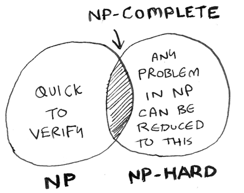

NP-complete problems are
- Hard to solve (at least right now; if someone proves that P = NP, they would not be)
- Easy to verify

And any problem in NP can be reduced to a problem that is NP-complete.

Here are the terms we defined in this:
- Decision problems
- The SAT problem
- P versus NP
- Reductions
- NP-hard
- NP-complete

When you see a discussion about NP-complete problems, I hope you’ll feel more confident about what these terms mean!

# Recap
- A problem is in P if it is both quick to solve and quick to verify.
- A problem is in NP if it is quick to verify. It may or may not be quick to solve.
- If we find a fast (polynomial time) algorithm for every problem in NP, then P = NP.
- A problem is NP-hard if any problem in NP can be reduced to that problem.
- If a problem is in both NP and NP-hard, it is NP-complete.

